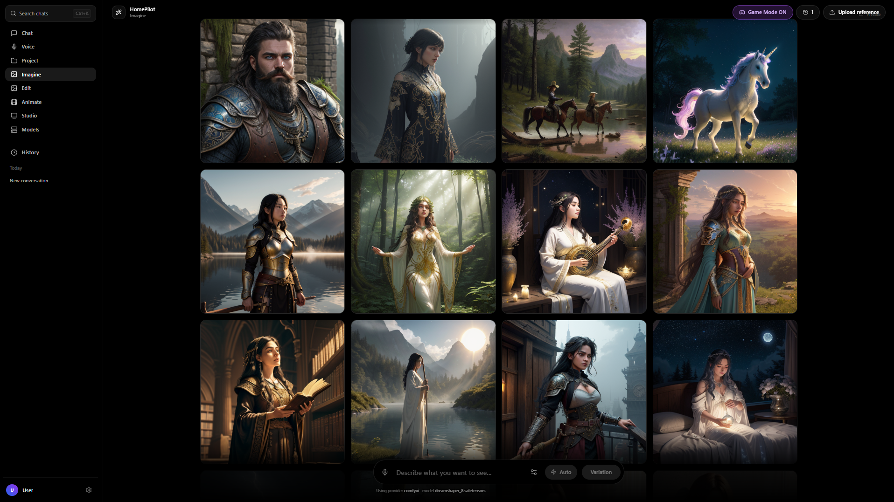
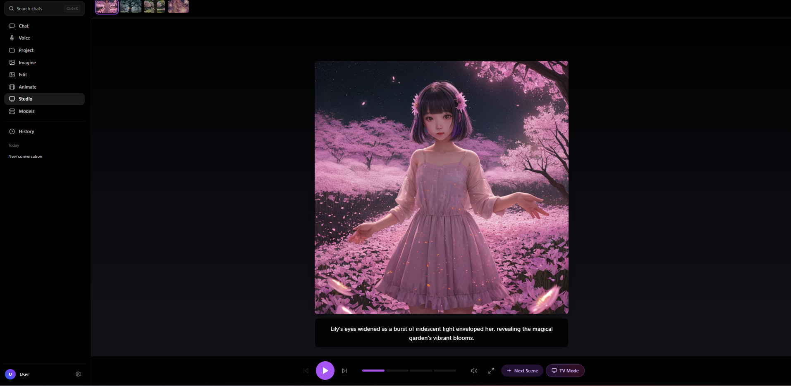
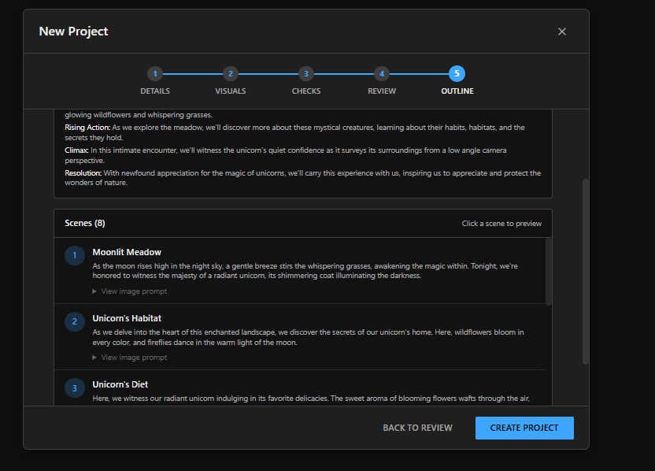
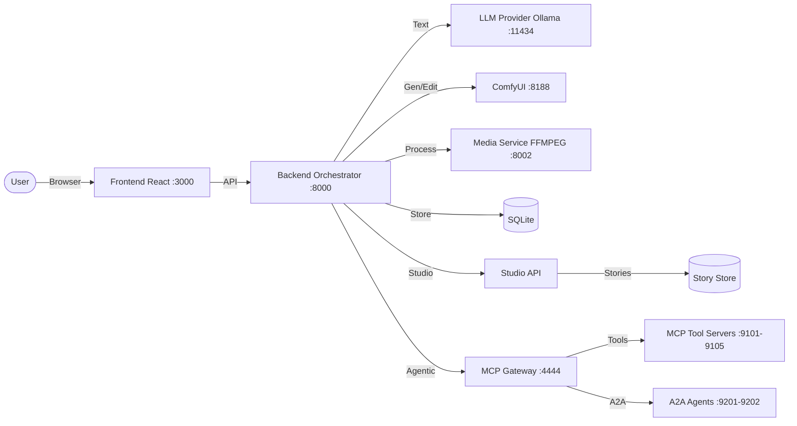

<p align="center">
  
</p>

<p align="center">
  
  
  
  
  
  
</p>

**HomePilot** is an all-in-one, local-first GenAI application that unifies **chat, image generation, editing, video creation, and AI-powered storytelling** into a **single continuous conversation**. Designed to deliver a high-end experience, it remains entirely **self-hosted, auditable, and extensible**.

This repository contains the **"Home Edition"**: a production-oriented stack designed to run on a local machine (ideally with an NVIDIA GPU) using Docker Compose.

<p align="center">
  
</p>

---

## ✨ What's New

### 🎭 Personas — Persistent AI Identities
A **Persona** in HomePilot is not a chatbot, not a voice skin, and not a prompt template. It is a **persistent AI identity** — a named, visual, voice-enabled entity with its own personality, appearance, long-term memory, and session history that evolves with you over time. Where traditional assistants forget you between conversations, a Persona remembers. Where traditional UIs give you a text box, a Persona gives you a face, a voice, and a relationship. One identity, many sessions, continuous context — this is the foundation for AI that actually knows who it's talking to. See [docs/PERSONA.md](docs/PERSONA.md) for the full specification.

### 📦 Persona Portability — Share & Install Anywhere
Create a persona in Tokyo, share it with someone in Brazil, and they get the exact same identity — personality, tools, and all. HomePilot now packages personas into a portable **`.hpersona`** file that carries everything needed to reproduce the experience on any machine:
- **Export** any persona project as a single `.hpersona` package with one click
- **Import** by dragging the file into HomePilot — a 3-step preview shows the persona card, system prompt, and a dependency check (models, tools, MCP servers, A2A agents) before installing
- **Dependency awareness** — the package records which image models, personality tools, MCP servers, and A2A agents the persona relies on; the importer shows green/amber/red status for each so you know what's ready and what needs setup
- **Schema versioned** (v2) with backward compatibility — today's exports will still import correctly in future versions
- **Durable avatars** — persona images are committed into project-owned storage with top-crop face-anchored thumbnails, surviving host changes and container restarts

### 🌐 Community Gallery — Browse, Download, Install
A public persona registry where anyone can browse, download, and install community-created personas. HomePilot supports two gallery backends:
- **Browse** — search by name, filter by tag, content rating; see preview cards
- **One-click install** — download → preview (persona card + dependency check) → import, all without leaving the app
- **Backend proxy** — the frontend never calls external URLs; a caching proxy at `/community/*` keeps CORS clean and keys private
- **Cloudflare Worker** — production tier with R2 storage, immutable versioned assets, aggressive CDN caching
- **GitHub-native pipeline** — zero-infrastructure tier using GitHub Issues for submission, Actions for validation, Releases for storage, and Pages for the gallery
- **Submit a persona** — open a [GitHub Issue](https://github.com/ruslanmv/HomePilot/issues/new?template=persona-submission.yml), attach your `.hpersona`, and a maintainer approves it with one label click
- **Automated publish** — once approved, the pipeline validates, creates a Release, updates `registry.json`, and deploys to [GitHub Pages](https://ruslanmv.github.io/HomePilot/gallery.html)
- See [docs/COMMUNITY_GALLERY.md](docs/COMMUNITY_GALLERY.md) for the full architecture and setup guide

### 🧠 Persona Memory — Adaptive & Basic Engines

Every persona has persistent memory that survives across sessions. Two engines let you choose the right behavior for each persona:

<p align="center">
  <br>
  <em>Adaptive Memory learns and forgets like a human brain. Basic Memory is deterministic and fully auditable.</em>
</p>

<p align="center">
  <br>
  <em>Adaptive Memory organizes knowledge into three tiers — Working (short-lived), Semantic (stable), and Pinned (permanent) — with exponential decay and reinforcement.</em>
</p>

<p align="center">
  <br>
  <em>Unused memories fade over time; accessed memories grow stronger. The system stays lean and relevant automatically.</em>
</p>

- **Adaptive Memory** — brain-inspired engine with decay, reinforcement, consolidation, and pruning; ideal for companion and assistant personas
- **Basic Memory** — deterministic flat store with TTL, per-category caps, near-duplicate detection, and pin-to-keep; ideal for secretary and enterprise personas
- Switch between engines at any time from Settings or during `.hpersona` import — no data loss

For the full technical deep dive (math, configuration, architecture), see **[docs/MEMORY.md](docs/MEMORY.md)**.

### 🎬 Animate Studio Enhancements
Professional video generation controls for image-to-video:
- **Video Settings Panel** - Aspect Ratio, Quality Preset, and Motion controls
- **Resolution Override** - Test different resolutions (Lowest 6GB to Ultra) in Advanced Controls
- **Hardware Presets** - Optimized configurations for RTX 4060, 4080, A100, and custom setups
- **Video Details** - Shows Resolution, Aspect Ratio, and Preset used for reproducibility
- **LTX-Optimized Presets** - Tuned for LTX-Video-2B with optimal CFG (3.0-3.5) and 16:9 native support

### 🖼️ Edit Studio Enhancements
One-click image editing tools integrated into the Edit page:
- **Quick Enhance** - Enhance photo quality, restore artifacts, fix faces
- **Upscale** - 2x/4x resolution increase with UltraSharp AI
- **Background Tools** - Remove, replace, or blur backgrounds
- **Outpaint** - Extend canvas in any direction (7 options)
- **Identity Tools** - Optional face-preserving edits and Same Person generation via InstantID (`make download-avatar-models-basic`)
- **Capabilities API** - Runtime feature availability checking (`/v1/capabilities`)

### 🎬 Creator Studio
A professional content creation suite for YouTube creators, educators, and enterprises:
- **AI Story Outline Generation** - Generate complete story arcs with scene-by-scene planning
- **Project Settings** - Full wizard-style configuration for format, style, and tone
- **Scene Management** - Add, edit, delete, and reorder scenes
- **TV Mode** - Cinematic fullscreen playback experience
- **Export Options** - PDF storyboards, PPTX slides, and asset bundles

### 🤖 Agentic AI with MCP Context Forge
Create intelligent **AI Agents** that can use tools, access knowledge bases, and take actions on your behalf:
- **Agent Projects** - New project type with a guided 4-step wizard (Details → Capabilities → Knowledge → Review)
- **Dynamic Capabilities** - Agents discover available tools at runtime (image generation, video creation, document analysis, external automation)
- **MCP Gateway** - Powered by [MCP Context Forge](https://github.com/ruslanmv/mcp-context-forge), a local gateway that connects your agents to 20+ tool servers
- **Built-in MCP Servers** - 5 MCP tool servers (Personal Assistant, Knowledge, Decision Copilot, Executive Briefing, Web Search) and 2 A2A agents (Everyday Assistant, Chief of Staff) launch automatically with `make start`
- **Web Search** - SearXNG for home users (no API key) or Tavily for enterprise, providing real-time web research tools
- **Ask-Before-Acting** - Safety-first execution with configurable autonomy levels
- **Voice Mode Media** - Generated images and videos now render directly in Voice mode conversations

### 🎮 Play Story Mode
Simple, relaxing story creation for beginners:
- Enter a premise and watch your story come to life
- AI-generated scenes with automatic image generation
- Intuitive scene navigation with visual chips
- One-click TV Mode for immersive viewing

---

## 🎯 Project Aim

HomePilot aims to build a **single conversational GenAI system** where:

* **Unified Timeline:** Text, images, and video live in one chronological feed.
* **Multimodal:** Users can ask questions, generate art, edit assets, create stories, and animate video without context switching.
* **Natural Interaction:** Outputs appear naturally as part of the flow.
* **Privacy First:** Everything runs locally. Your data never leaves your machine.
* **Professional Creation:** Full-featured studio for content creators and enterprises.

This serves as the foundation for an "enterprise mind" capable of expanding into complex tool usage and automation.

---

## ⚡ Key Capabilities

### Core Features

| Feature | Description |
| :--- | :--- |
| **Chat (LLM)** | Multi-turn conversations with OpenAI-style routing. Includes a "Fun mode" for creative tone modification. Support for backend-hosted LLMs or Ollama. |
| **Imagine** | Text-to-image generation powered by a workflow-driven pipeline (ComfyUI). |
| **Edit** | Upload an image and describe changes to modify it naturally within the chat. |
| **Animate** | Turn still images into short video clips with configurable aspect ratio, quality presets, and motion controls. Supports multiple video models (LTX, Wan, SVD, Hunyuan, Mochi, CogVideo). |

### Studio Features

| Feature | Description |
| :--- | :--- |
| **Play Story** | Simple story creation mode. Enter a premise, generate scenes, and watch your story unfold with AI-generated images. |
| **Creator Studio** | Professional project-based workflow with presets, style kits, and advanced generation settings. |
| **AI Story Outline** | Generate complete story structures including beginning, rising action, climax, falling action, and resolution. |
| **Scene Editor** | Edit narration, image prompts, and negative prompts for each scene. Regenerate images on demand. |
| **TV Mode** | Immersive fullscreen playback with auto-advance, narration display, and cinematic transitions. |
| **Project Settings** | Comprehensive configuration: format (16:9/9:16), intent (Entertain/Educate/Inspire), visual style, mood & tone. |
| **Agent Projects** | Create AI agents with custom goals, tool capabilities, and knowledge bases through a guided wizard. Powered by MCP Context Forge. |

---

## 🎬 Studio Modes

### Play Story Mode
*Recommended for beginners*


Perfect for quick, relaxed story creation:
1. Enter your story premise (e.g., "A detective solves mysteries in a cyberpunk city")
2. AI generates scene narration and image prompts
3. Images are automatically generated for each scene
4. Navigate through scenes or watch in TV Mode

### Creator Studio
*Advanced features for professionals*

Full control over your content:

#### Project Configuration
- **Format**: YouTube Video (16:9), YouTube Short (9:16), or Slides
- **Intent**: Entertain, Educate, or Inspire
- **Visual Style**: Cinematic, Digital Art, or Anime
- **Mood & Tone**: Documentary, Dramatic, Calm, Upbeat, Dark
- **Episode Length**: Configure scenes per episode and scene duration

#### AI Story Outline
Generate a complete story structure with:
- Story arc (beginning → climax → resolution)
- Scene-by-scene breakdown
- Narration and image prompts for each scene
- Automatic scene generation from outline




#### Scene Management
- Add, edit, and delete scenes
- Custom narration and image prompts
- Negative prompt support for image quality
- Regenerate images with one click

#### Export Options
- Storyboard PDF
- Presentation slides (PPTX/PDF)
- Asset bundle (ZIP)

---

## 🖥️ User Interface

### Unified Dark Theme
A Grok-like dark minimal interface with:
- Sidebar navigation with mode switching
- Context-aware input with media upload
- Inline media rendering
- Responsive design for desktop and tablet

### TV Mode


Cinematic fullscreen experience:
- Auto-advance through scenes
- Narration subtitle overlay
- Progress indicator
- Keyboard controls (Space to play/pause, arrows to navigate)

### Project Management
- View all projects (Play Story + Creator Studio)
- Quick access with thumbnail previews
- Delete projects you don't need
- Status badges (Draft, In Review, Finished)

---

## 🏗️ Architecture Overview

The system is modular, consisting of replaceable services orchestrated via Docker.



### Data & Storage

* **Metadata:** Stored locally in SQLite.
* **Media:** Generated outputs are written to disk (`./outputs`).
* **Stories:** Project data and scenes stored in-memory (MVP) or SQLite.
* **Privacy:** No external telemetry. Services bind to `127.0.0.1` by default.

---

## 📂 Repository Structure

The codebase is organized into `frontend/`, `backend/`, `agentic/`, `community/`, `comfyui/`, `media/`, and `infra/` — each a self-contained layer. For the full annotated tree, see **[STRUCTURE.md](STRUCTURE.md)**.

---

## 🛠️ Requirements

### System

* **OS:** Linux or WSL2 (Recommended). macOS supported (CPU-only constraints apply).
* **Runtime:** Docker Engine + Docker Compose plugin.
* **Dev:** Node.js 20+ (Only for local frontend development).

### GPU (Recommended)

* **Hardware:** NVIDIA GPU with 8GB+ VRAM (12GB+ recommended for FLUX models).
* **Drivers:** Latest NVIDIA drivers + NVIDIA Container Toolkit.
* *Note: If running without a GPU, disable GPU runtime settings in `docker-compose.yml`.*

### LLM Requirements

* **Ollama:** Automatically pulls models when needed.
* **Recommended Models:**
  - `llama3.2` - Fast, general purpose
  - `mistral` - Good balance of speed and quality
  - `deepseek-r1` - Advanced reasoning capabilities

---

## 🚀 Quickstart

### 1. Clone

```bash
git clone https://github.com/ruslanmv/homepilot
cd homepilot
```

### 2. Configure Environment

```bash
cp .env.example .env
# Edit .env to set ports, API keys, or paths
```

### 3. Download Models (Automated)

HomePilot provides automated model installation with three preset options:

```bash
# Recommended: FLUX Schnell + SDXL (~14GB)
make download-recommended

# Or choose a different preset:
# make download-minimal      # ~7GB - FLUX Schnell only
# make download-full         # ~65GB - All models including FLUX Dev, SD1.5, SVD
```

The script automatically:
- ✓ Checks if models exist before downloading
- ✓ Resumes interrupted downloads
- ✓ Retries failed downloads with exponential backoff
- ✓ Shows progress and summary statistics

For detailed installation options and manual installation, see [MODEL_INSTALLATION.md](MODEL_INSTALLATION.md)

**LLM Models** are managed separately via Ollama (auto-pulled when needed).

### 4. Build and Run

```bash
make install
make run
```

### 5. Access

* **UI:** `http://localhost:3000`
* **API Docs:** `http://localhost:8000/docs`
* **ComfyUI:** `http://localhost:8188`
* **MCP Gateway:** `http://localhost:4444/admin` *(when agentic mode is enabled)*

---

## 🎮 Using the Interface

### Chat Modes

HomePilot uses **Modes** to route user intent:

1. **Chat Mode:** Standard reasoning and conversation.
2. **Imagine Mode:** Auto-formats prompts for text-to-image generation.
3. **Edit Mode:** Upload an image → Describe changes → Receive edited image.
4. **Animate Mode:** Upload an image → Describe motion → Receive video clip.

### Studio Modes

Access from the sidebar or main interface:

1. **Play Story:** Quick story creation with AI-generated scenes.
2. **Creator Studio:** Professional project workflow with full control.

### Studio Quick Start

#### Play Story
1. Click "Play Story" from the studio menu
2. Click "New Story" and enter a premise
3. Watch as scenes are generated automatically
4. Use scene chips to navigate or enter TV Mode

#### Creator Studio
1. Click "Creator Studio" from the studio menu
2. Complete the 4-step wizard:
   - **Details:** Title, format, intent, episode length
   - **Visuals:** Style preset, mood & tone
   - **Checks:** Consistency lock, content rating
   - **Review:** Confirm settings and create
3. Generate your first scene
4. Use the ⚙️ Settings button to modify project configuration anytime

### Settings

Located in the bottom-left of the sidebar:

* **Backend URL:** Switch backends dynamically.
* **Provider:** Toggle between internal Backend routing (Recommended) or direct Ollama connection.

---

## 🔌 API Reference — 160+ Endpoints

HomePilot exposes **160+ REST endpoints** across core chat, media generation, personas, studio, agentic AI, and community gallery. Interactive Swagger docs are available at `http://localhost:8000/docs` after launch.

For the complete endpoint-by-endpoint reference, see **[API.md](API.md)**.

**Highlights:**

| Surface | Endpoints | Description |
| :--- | :--- | :--- |
| Core | `/chat`, `/health`, `/models`, `/upload` | Chat, health, model catalog |
| Personas | `/persona/*`, `/api/personalities` | 15 personalities, sessions, memory, `.hpersona` export/import |
| Studio | `/studio/*` (65+ routes) | Creator projects, scenes, outlines, export (PDF/PPTX/ZIP) |
| Enhancement | `/v1/enhance`, `/v1/upscale`, `/v1/background`, `/v1/outpaint` | Image editing pipeline |
| Agentic AI | `/v1/agentic/*` (11 routes) | MCP Gateway invoke, tool discovery, registration |
| Community | `/community/*` | Gallery browse, download, install |
| Story | `/story/*` | Play Story mode, scene generation |

---

## ⚙️ Workflows (ComfyUI)

HomePilot is **workflow-driven**. Instead of hardcoded pipelines, it loads JSON workflows from `comfyui/workflows/`.

* **Flexibility:** To upgrade generation capabilities, simply update the JSON workflow file.
* **Process:** Backend injects prompts into the JSON → Submits to ComfyUI → Polls for results → Returns media URL.

### Available Workflows

- `flux_schnell.json` - Fast FLUX image generation
- `sdxl_base.json` - SDXL image generation
- `animate.json` - Image-to-video animation (LTX-Video)
- `wan_i2v.json` - Wan image-to-video
- `svd_animate.json` - Stable Video Diffusion
- `edit.json` - Image editing with inpainting

---

## 💻 Makefile Commands

| Command | Description |
| --- | --- |
| `make help` | Show available commands |
| `make install` | Install dependencies and build Docker images |
| `make download` | Download recommended models (~14GB) |
| `make download-minimal` | Download minimal models (~7GB) |
| `make download-full` | Download all models (~65GB) |
| `make download-verify` | Verify downloaded models and show disk usage |
| `make run` | Start the full stack (detached) |
| `make logs` | Tail logs for all services |
| `make down` | Stop and remove containers |
| `make health` | Run best-effort health checks |
| `make health-check` | Comprehensive health check of all services |
| `make start` | Start all services (set `AGENTIC=1` for MCP + tool servers) |
| `make start-mcp` | Start MCP Context Forge gateway and servers |
| `make start-agentic-servers` | Start MCP tool servers + A2A agents standalone |
| `make mcp-register-homepilot` | Register default tools with MCP Gateway |
| `make dev` | Run frontend locally + backend in Docker |
| `make clean` | Remove local artifacts and cache |
| `make community-bootstrap` | Bootstrap Cloudflare R2 + Worker + Pages for Community Gallery |
| `make community-deploy-worker` | Deploy the Community Gallery Worker |
| `make community-deploy-pages` | Deploy the Community Gallery static site |

---

## 🎨 Customization

### Adding Visual Styles

Edit `backend/app/studio/library.py` to add custom style kits:

```python
StyleKit(
    id="sk_custom",
    name="My Custom Style",
    thumbnail_url="/assets/styles/custom.jpg",
    base_prompt_suffix="your style keywords here",
    negative_prompt="elements to avoid",
    recommended_models=["flux-schnell"],
)
```

### Adding Templates

Add project templates for quick starts:

```python
ProjectTemplate(
    id="tmpl_custom",
    name="My Template",
    description="Description here",
    category="education",
    default_scene_count=6,
    default_scene_duration_sec=5,
    style_kit_id="sk_modern_light",
    sample_outline=["Scene 1", "Scene 2", ...],
)
```

---

## 🗺️ Roadmap

### Completed
- [x] Play Story mode with AI scene generation
- [x] Creator Studio with project wizard
- [x] AI-powered story outline generation
- [x] Scene management (add, edit, delete)
- [x] TV Mode for immersive playback
- [x] Project settings modal
- [x] Export functionality (PDF, PPTX, ZIP)
- [x] Edit Studio: Quick Enhance, Upscale 2x/4x, Background Tools, Outpaint
- [x] Capabilities API for runtime feature checks
- [x] Animate Studio: Video Settings panel, Resolution Override, Hardware Presets
- [x] Multi-model video support (LTX, Wan, SVD, Hunyuan, Mochi, CogVideo)

- [x] Agentic AI: Agent project type with 4-step creation wizard
- [x] MCP Context Forge integration with dynamic capability discovery
- [x] Built-in MCP tool servers (Personal Assistant, Knowledge, Decision Copilot, Executive Briefing, Web Search) and A2A agents (Everyday Assistant, Chief of Staff)
- [x] Web Search MCP server with SearXNG (home) and Tavily (enterprise) providers
- [x] Voice mode media rendering (images and videos)
- [x] Voice Input/Output with browser TTS and speech recognition
- [x] Voice narration with TTS (6 voice personas, speed control, hands-free mode)
- [x] 15 built-in personality agents with backend-authoritative prompts
- [x] Custom Personas with linked/unlinked project modes
- [x] Adult content gating with age verification
- [x] Persona portability: `.hpersona` export/import with dependency manifests (tools, MCP, A2A, models)
- [x] Durable avatar storage with face-anchored thumbnails
- [x] First-time persona welcome screen (replaces empty "Continue Last Session")
- [x] Community Gallery: Cloudflare R2 + Worker persona registry with MMORPG patcher pattern
- [x] Community browse & one-click install from "Shared with me" tab
- [x] GitHub-native persona submission pipeline (Issue template → Actions → Release → Pages gallery)
- [x] Persona submission moderation workflow (admin-gated label approval)
- [x] Community Gallery web page on GitHub Pages with search, filters, and download

### In Progress
- [ ] Background music integration
- [ ] Timeline editor with drag-and-drop
- [ ] Multi-chapter support

### Planned
- [ ] MP4 video export with ffmpeg
- [ ] Collaborative editing
- [ ] Plugin system for custom workflows
- [ ] Multi-provider LLM routing
- [ ] OpenTelemetry observability

---

## 🐛 Troubleshooting

### Common Issues

**Story outline generation fails**
- Ensure Ollama is running and accessible
- Check that at least one LLM model is available
- Verify the backend can connect to Ollama

**Images not generating**
- Verify ComfyUI is running (`http://localhost:8188`)
- Check that image models are downloaded
- Review backend logs for workflow errors

**TV Mode not working**
- Ensure at least one scene exists
- Check browser console for errors
- Try refreshing the page

### Logs

```bash
# View all logs
make logs

# View specific service
docker compose logs -f backend
docker compose logs -f comfyui
```

---

## 🤝 Contributing

Contributions are welcome! Please check `CONTRIBUTING.md` for coding standards and PR checklists.

### Development Setup

```bash
# Frontend development (hot reload)
cd frontend
npm install
npm run dev

# Backend development
cd backend
pip install -r requirements.txt
uvicorn app.main:app --reload
```

---

## 📄 License

Apache-2.0

---

## 🙏 Acknowledgments

- [ComfyUI](https://github.com/comfyanonymous/ComfyUI) - Powerful image generation backend
- [Ollama](https://ollama.ai) - Local LLM inference
- [FLUX](https://blackforestlabs.ai) - State-of-the-art image models
- [React](https://react.dev) - UI framework
- [FastAPI](https://fastapi.tiangolo.com) - Backend framework
- [Zustand](https://zustand-demo.pmnd.rs) - State management
- [MCP Context Forge](https://github.com/ruslanmv/mcp-context-forge) - Agentic AI gateway and tool servers

---

<p align="center">
  <b>HomePilot</b> - Your AI-Powered Creative Studio
  <br>
  <sub>Built with ❤️ for creators, by creators</sub>
  <br><br>
  <sub>🎭 15 personality agents with conversation memory, dynamic prompts, and per-turn engagement — plus portable persona packages you can share with the world.</sub>
</p>
