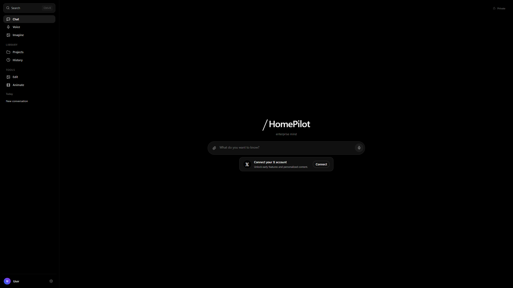
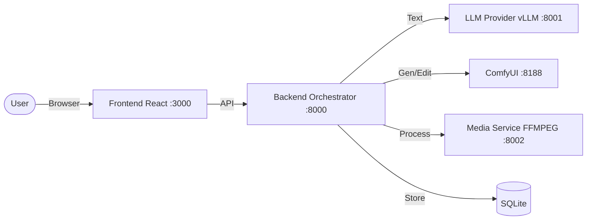

# HomePilot Enterprise Mind


**HomePilot** is an all-in-one, local-first GenAI application that unifies **chat, image generation, editing, and video creation** into a **single continuous conversation**. Designed to deliver a high-end experience, it remains entirely **self-hosted, auditable, and extensible**.

This repository contains the **"Home Edition"**: a production-oriented stack designed to run on a local machine (ideally with an NVIDIA GPU) using Docker Compose.



---

## 🎯 Project Aim

HomePilot aims to build a **single conversational GenAI system** where:

* **Unified Timeline:** Text, images, and video live in one chronological feed.
* **Multimodal:** Users can ask questions, generate art, edit assets, and animate video without context switching.
* **Natural Interaction:** Outputs appear naturally as part of the flow.
* **Privacy First:** Everything runs locally. Your data never leaves your machine.

This serves as the foundation for an "enterprise mind" capable of expanding into complex tool usage and automation.

---

## ⚡ Key Capabilities

| Feature | Description |
| :--- | :--- |
| **Chat (LLM)** | Multi-turn conversations with OpenAI-style routing. Includes a "Fun mode" for creative tone modification. Support for backend-hosted LLMs or Ollama. |
| **Imagine** | Text-to-image generation powered by a workflow-driven pipeline (ComfyUI). |
| **Edit** | Upload an image and describe changes to modify it naturally within the chat. |
| **Animate** | Turn still images into short video clips using localized motion workflows. |
| **Unified UI** | A Grok-like dark minimal interface with sidebar navigation, context-aware input, and inline media rendering. |

---

## 🏗️ Architecture Overview

The system is modular, consisting of replaceable services orchestrated via Docker.



### Data & Storage

* **Metadata:** Stored locally in SQLite.
* **Media:** Generated outputs are written to disk (`./outputs`).
* **Privacy:** No external telemetry. Services bind to `127.0.0.1` by default.

---

## 📂 Repository Structure

The folder structure follows a standard microservices layout:

```text
homepilot/
├── frontend/           # React/Vite UI application
├── backend/            # FastAPI orchestrator
├── comfyui/            # Workflows and integration assets
├── media/              # Media service (ffmpeg helpers)
├── infra/              # Docker infrastructure
│   └── docker-compose.yml
├── models/             # Mounted model directories
│   ├── llm/            # Local LLM model files
│   └── comfy/          # Checkpoints, LoRAs, VAEs
├── outputs/            # Generated artifacts
├── Makefile            # Automation commands
└── README.md

```

---

## 🛠️ Requirements

### System

* **OS:** Linux or WSL2 (Recommended). macOS supported (CPU-only constraints apply).
* **Runtime:** Docker Engine + Docker Compose plugin.
* **Dev:** Node.js 20+ (Only for local frontend development).

### GPU (Recommended)

* **Hardware:** NVIDIA GPU.
* **Drivers:** Latest NVIDIA drivers + NVIDIA Container Toolkit.
* *Note: If running without a GPU, disable GPU runtime settings in `docker-compose.yml`.*

---

## 🚀 Quickstart

### 1. Clone

```bash
git clone https://github.com/ruslanmv/homepilot
cd homepilot

```

### 2. Configure Environment

```bash
cp .env.example .env
# Edit .env to set ports, API keys, or paths

```

### 3. Download Models (Automated)

HomePilot provides automated model installation with three preset options:

```bash
# Recommended: FLUX Schnell + SDXL (~14GB)
make download-recommended

# Or choose a different preset:
# make download-minimal      # ~7GB - FLUX Schnell only
# make download-full         # ~65GB - All models including FLUX Dev, SD1.5, SVD
```

The script automatically:
- ✓ Checks if models exist before downloading
- ✓ Resumes interrupted downloads
- ✓ Retries failed downloads with exponential backoff
- ✓ Shows progress and summary statistics

For detailed installation options and manual installation, see [MODEL_INSTALLATION.md](MODEL_INSTALLATION.md)

**LLM Models** are managed separately via Ollama (auto-pulled when needed) or manually via vLLM.

### 4. Build and Run

```bash
make install
make run

```

### 5. Access

* **UI:** `http://localhost:3000`
* **API Docs:** `http://localhost:8000/docs`
* **ComfyUI:** `http://localhost:8188`

---

## 🎮 Using the Interface

HomePilot uses **Modes** to route user intent:

1. **Chat Mode:** Standard reasoning and conversation.
2. **Imagine Mode:** Auto-formats prompts for text-to-image generation.
3. **Edit Mode:** Upload an image → Describe changes → Receive edited image.
4. **Animate Mode:** Upload an image → Describe motion → Receive video clip.

### Settings

Located in the bottom-left of the sidebar:

* **Backend URL:** Switch backends dynamically.
* **Provider:** Toggle between internal Backend routing (Recommended) or direct Ollama connection.

---

## ⚙️ Workflows (ComfyUI)

HomePilot is **workflow-driven**. Instead of hardcoded pipelines, it loads JSON workflows from `comfyui/workflows/`.

* **Flexibility:** To upgrade generation capabilities, simply update the JSON workflow file.
* **Process:** Backend injects prompts into the JSON → Submits to ComfyUI → Polls for results → Returns media URL.

---

## 💻 Makefile Commands

| Command | Description |
| --- | --- |
| `make help` | Show available commands |
| `make install` | Install dependencies and build Docker images |
| `make download` | Download recommended models (~14GB) |
| `make download-minimal` | Download minimal models (~7GB) |
| `make download-full` | Download all models (~65GB) |
| `make download-verify` | Verify downloaded models and show disk usage |
| `make run` | Start the full stack (detached) |
| `make logs` | Tail logs for all services |
| `make down` | Stop and remove containers |
| `make health` | Run best-effort health checks |
| `make health-check` | Comprehensive health check of all services |
| `make dev` | Run frontend locally + backend in Docker |
| `make clean` | Remove local artifacts and cache |

---

## 🗺️ Roadmap

* [ ] Multi-provider LLM routing (Backend managed)
* [ ] Voice Input/Output integration
* [ ] Conversation history management and tagging
* [ ] Plugin system for specialized tools
* [ ] OpenTelemetry observability

---

## 🤝 Contributing

Contributions are welcome! Please check `CONTRIBUTING.md` for coding standards and PR checklists.

## 📄 License

Apache-2.0

