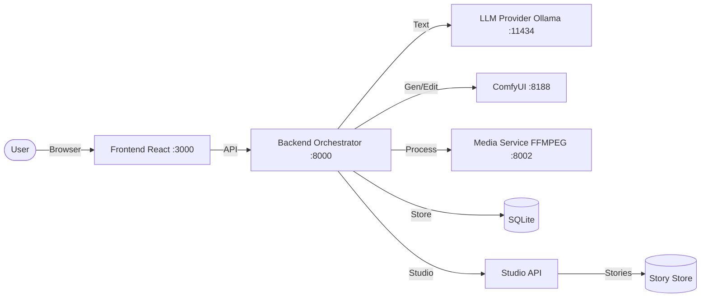

# HomePilot


**HomePilot** is an all-in-one, local-first GenAI application that unifies **chat, image generation, editing, video creation, and AI-powered storytelling** into a **single continuous conversation**. Designed to deliver a high-end experience, it remains entirely **self-hosted, auditable, and extensible**.

This repository contains the **"Home Edition"**: a production-oriented stack designed to run on a local machine (ideally with an NVIDIA GPU) using Docker Compose.


---

## ✨ What's New

### 🖼️ Edit Studio Enhancements
One-click image editing tools integrated into the Edit page:
- **Quick Enhance** - Enhance photo quality, restore artifacts, fix faces
- **Upscale** - 2x/4x resolution increase with UltraSharp AI
- **Background Tools** - Remove, replace, or blur backgrounds
- **Outpaint** - Extend canvas in any direction (7 options)
- **Capabilities API** - Runtime feature availability checking (`/v1/capabilities`)

### 🎬 Creator Studio
A professional content creation suite for YouTube creators, educators, and enterprises:
- **AI Story Outline Generation** - Generate complete story arcs with scene-by-scene planning
- **Project Settings** - Full wizard-style configuration for format, style, and tone
- **Scene Management** - Add, edit, delete, and reorder scenes
- **TV Mode** - Cinematic fullscreen playback experience
- **Export Options** - PDF storyboards, PPTX slides, and asset bundles

### 🎮 Play Story Mode
Simple, relaxing story creation for beginners:
- Enter a premise and watch your story come to life
- AI-generated scenes with automatic image generation
- Intuitive scene navigation with visual chips
- One-click TV Mode for immersive viewing

---

## 🎯 Project Aim

HomePilot aims to build a **single conversational GenAI system** where:

* **Unified Timeline:** Text, images, and video live in one chronological feed.
* **Multimodal:** Users can ask questions, generate art, edit assets, create stories, and animate video without context switching.
* **Natural Interaction:** Outputs appear naturally as part of the flow.
* **Privacy First:** Everything runs locally. Your data never leaves your machine.
* **Professional Creation:** Full-featured studio for content creators and enterprises.

This serves as the foundation for an "enterprise mind" capable of expanding into complex tool usage and automation.

---

## ⚡ Key Capabilities

### Core Features

| Feature | Description |
| :--- | :--- |
| **Chat (LLM)** | Multi-turn conversations with OpenAI-style routing. Includes a "Fun mode" for creative tone modification. Support for backend-hosted LLMs or Ollama. |
| **Imagine** | Text-to-image generation powered by a workflow-driven pipeline (ComfyUI). |
| **Edit** | Upload an image and describe changes to modify it naturally within the chat. |
| **Animate** | Turn still images into short video clips using localized motion workflows. |

### Studio Features

| Feature | Description |
| :--- | :--- |
| **Play Story** | Simple story creation mode. Enter a premise, generate scenes, and watch your story unfold with AI-generated images. |
| **Creator Studio** | Professional project-based workflow with presets, style kits, and advanced generation settings. |
| **AI Story Outline** | Generate complete story structures including beginning, rising action, climax, falling action, and resolution. |
| **Scene Editor** | Edit narration, image prompts, and negative prompts for each scene. Regenerate images on demand. |
| **TV Mode** | Immersive fullscreen playback with auto-advance, narration display, and cinematic transitions. |
| **Project Settings** | Comprehensive configuration: format (16:9/9:16), intent (Entertain/Educate/Inspire), visual style, mood & tone. |

---

## 🎬 Studio Modes

### Play Story Mode
*Recommended for beginners*


Perfect for quick, relaxed story creation:
1. Enter your story premise (e.g., "A detective solves mysteries in a cyberpunk city")
2. AI generates scene narration and image prompts
3. Images are automatically generated for each scene
4. Navigate through scenes or watch in TV Mode

### Creator Studio
*Advanced features for professionals*

Full control over your content:

#### Project Configuration
- **Format**: YouTube Video (16:9), YouTube Short (9:16), or Slides
- **Intent**: Entertain, Educate, or Inspire
- **Visual Style**: Cinematic, Digital Art, or Anime
- **Mood & Tone**: Documentary, Dramatic, Calm, Upbeat, Dark
- **Episode Length**: Configure scenes per episode and scene duration

#### AI Story Outline
Generate a complete story structure with:
- Story arc (beginning → climax → resolution)
- Scene-by-scene breakdown
- Narration and image prompts for each scene
- Automatic scene generation from outline


#### Scene Management
- Add, edit, and delete scenes
- Custom narration and image prompts
- Negative prompt support for image quality
- Regenerate images with one click

#### Export Options
- Storyboard PDF
- Presentation slides (PPTX/PDF)
- Asset bundle (ZIP)

---

## 🖥️ User Interface

### Unified Dark Theme
A Grok-like dark minimal interface with:
- Sidebar navigation with mode switching
- Context-aware input with media upload
- Inline media rendering
- Responsive design for desktop and tablet

### TV Mode


Cinematic fullscreen experience:
- Auto-advance through scenes
- Narration subtitle overlay
- Progress indicator
- Keyboard controls (Space to play/pause, arrows to navigate)

### Project Management
- View all projects (Play Story + Creator Studio)
- Quick access with thumbnail previews
- Delete projects you don't need
- Status badges (Draft, In Review, Finished)

---

## 🏗️ Architecture Overview

The system is modular, consisting of replaceable services orchestrated via Docker.



### Data & Storage

* **Metadata:** Stored locally in SQLite.
* **Media:** Generated outputs are written to disk (`./outputs`).
* **Stories:** Project data and scenes stored in-memory (MVP) or SQLite.
* **Privacy:** No external telemetry. Services bind to `127.0.0.1` by default.

---

## 📂 Repository Structure

```text
homepilot/
├── frontend/                 # React/Vite UI application
│   └── src/
│       └── ui/
│           ├── Studio.tsx              # Play Story mode
│           ├── CreatorStudioEditor.tsx # Creator Studio editor
│           ├── CreatorStudioHost.tsx   # Project wizard
│           └── studio/
│               ├── components/         # Reusable studio components
│               └── stores/             # Zustand state management
├── backend/
│   └── app/
│       └── studio/
│           ├── routes.py     # Studio API endpoints
│           ├── models.py     # Pydantic models
│           ├── repo.py       # Data repository
│           ├── library.py    # Templates and style kits
│           └── exporter.py   # Export functionality
├── comfyui/                  # Workflows and integration assets
├── media/                    # Media service (ffmpeg helpers)
├── infra/                    # Docker infrastructure
│   └── docker-compose.yml
├── models/                   # Mounted model directories
│   ├── llm/                  # Local LLM model files
│   └── comfy/                # Checkpoints, LoRAs, VAEs
├── outputs/                  # Generated artifacts
├── Makefile                  # Automation commands
└── README.md
```

---

## 🛠️ Requirements

### System

* **OS:** Linux or WSL2 (Recommended). macOS supported (CPU-only constraints apply).
* **Runtime:** Docker Engine + Docker Compose plugin.
* **Dev:** Node.js 20+ (Only for local frontend development).

### GPU (Recommended)

* **Hardware:** NVIDIA GPU with 8GB+ VRAM (12GB+ recommended for FLUX models).
* **Drivers:** Latest NVIDIA drivers + NVIDIA Container Toolkit.
* *Note: If running without a GPU, disable GPU runtime settings in `docker-compose.yml`.*

### LLM Requirements

* **Ollama:** Automatically pulls models when needed.
* **Recommended Models:**
  - `llama3.2` - Fast, general purpose
  - `mistral` - Good balance of speed and quality
  - `deepseek-r1` - Advanced reasoning capabilities

---

## 🚀 Quickstart

### 1. Clone

```bash
git clone https://github.com/ruslanmv/homepilot
cd homepilot
```

### 2. Configure Environment

```bash
cp .env.example .env
# Edit .env to set ports, API keys, or paths
```

### 3. Download Models (Automated)

HomePilot provides automated model installation with three preset options:

```bash
# Recommended: FLUX Schnell + SDXL (~14GB)
make download-recommended

# Or choose a different preset:
# make download-minimal      # ~7GB - FLUX Schnell only
# make download-full         # ~65GB - All models including FLUX Dev, SD1.5, SVD
```

The script automatically:
- ✓ Checks if models exist before downloading
- ✓ Resumes interrupted downloads
- ✓ Retries failed downloads with exponential backoff
- ✓ Shows progress and summary statistics

For detailed installation options and manual installation, see [MODEL_INSTALLATION.md](MODEL_INSTALLATION.md)

**LLM Models** are managed separately via Ollama (auto-pulled when needed).

### 4. Build and Run

```bash
make install
make run
```

### 5. Access

* **UI:** `http://localhost:3000`
* **API Docs:** `http://localhost:8000/docs`
* **ComfyUI:** `http://localhost:8188`

---

## 🎮 Using the Interface

### Chat Modes

HomePilot uses **Modes** to route user intent:

1. **Chat Mode:** Standard reasoning and conversation.
2. **Imagine Mode:** Auto-formats prompts for text-to-image generation.
3. **Edit Mode:** Upload an image → Describe changes → Receive edited image.
4. **Animate Mode:** Upload an image → Describe motion → Receive video clip.

### Studio Modes

Access from the sidebar or main interface:

1. **Play Story:** Quick story creation with AI-generated scenes.
2. **Creator Studio:** Professional project workflow with full control.

### Studio Quick Start

#### Play Story
1. Click "Play Story" from the studio menu
2. Click "New Story" and enter a premise
3. Watch as scenes are generated automatically
4. Use scene chips to navigate or enter TV Mode

#### Creator Studio
1. Click "Creator Studio" from the studio menu
2. Complete the 4-step wizard:
   - **Details:** Title, format, intent, episode length
   - **Visuals:** Style preset, mood & tone
   - **Checks:** Consistency lock, content rating
   - **Review:** Confirm settings and create
3. Generate your first scene
4. Use the ⚙️ Settings button to modify project configuration anytime

### Settings

Located in the bottom-left of the sidebar:

* **Backend URL:** Switch backends dynamically.
* **Provider:** Toggle between internal Backend routing (Recommended) or direct Ollama connection.

---

## 🔌 API Reference

### Studio Endpoints

| Endpoint | Method | Description |
| :--- | :--- | :--- |
| `/studio/videos` | GET | List all projects |
| `/studio/videos` | POST | Create new project |
| `/studio/videos/{id}` | GET | Get project details |
| `/studio/videos/{id}` | PATCH | Update project settings |
| `/studio/videos/{id}` | DELETE | Delete project |
| `/studio/videos/{id}/scenes` | GET | List scenes |
| `/studio/videos/{id}/scenes` | POST | Create scene |
| `/studio/videos/{id}/scenes/{sid}` | PATCH | Update scene |
| `/studio/videos/{id}/scenes/{sid}` | DELETE | Delete scene |
| `/studio/videos/{id}/generate-outline` | POST | Generate AI story outline |
| `/studio/videos/{id}/outline` | GET | Get existing outline |

### Chat Endpoints

| Endpoint | Method | Description |
| :--- | :--- | :--- |
| `/chat` | POST | Send message (chat/imagine/edit/animate) |
| `/models` | GET | List available models |
| `/health` | GET | Health check |

---

## ⚙️ Workflows (ComfyUI)

HomePilot is **workflow-driven**. Instead of hardcoded pipelines, it loads JSON workflows from `comfyui/workflows/`.

* **Flexibility:** To upgrade generation capabilities, simply update the JSON workflow file.
* **Process:** Backend injects prompts into the JSON → Submits to ComfyUI → Polls for results → Returns media URL.

### Available Workflows

- `flux_schnell.json` - Fast FLUX image generation
- `sdxl_base.json` - SDXL image generation
- `animate.json` - Image-to-video animation
- `edit.json` - Image editing with inpainting

---

## 💻 Makefile Commands

| Command | Description |
| --- | --- |
| `make help` | Show available commands |
| `make install` | Install dependencies and build Docker images |
| `make download` | Download recommended models (~14GB) |
| `make download-minimal` | Download minimal models (~7GB) |
| `make download-full` | Download all models (~65GB) |
| `make download-verify` | Verify downloaded models and show disk usage |
| `make run` | Start the full stack (detached) |
| `make logs` | Tail logs for all services |
| `make down` | Stop and remove containers |
| `make health` | Run best-effort health checks |
| `make health-check` | Comprehensive health check of all services |
| `make dev` | Run frontend locally + backend in Docker |
| `make clean` | Remove local artifacts and cache |

---

## 🎨 Customization

### Adding Visual Styles

Edit `backend/app/studio/library.py` to add custom style kits:

```python
StyleKit(
    id="sk_custom",
    name="My Custom Style",
    thumbnail_url="/assets/styles/custom.jpg",
    base_prompt_suffix="your style keywords here",
    negative_prompt="elements to avoid",
    recommended_models=["flux-schnell"],
)
```

### Adding Templates

Add project templates for quick starts:

```python
ProjectTemplate(
    id="tmpl_custom",
    name="My Template",
    description="Description here",
    category="education",
    default_scene_count=6,
    default_scene_duration_sec=5,
    style_kit_id="sk_modern_light",
    sample_outline=["Scene 1", "Scene 2", ...],
)
```

---

## 🗺️ Roadmap

### Completed
- [x] Play Story mode with AI scene generation
- [x] Creator Studio with project wizard
- [x] AI-powered story outline generation
- [x] Scene management (add, edit, delete)
- [x] TV Mode for immersive playback
- [x] Project settings modal
- [x] Export functionality (PDF, PPTX, ZIP)
- [x] Edit Studio: Quick Enhance, Upscale 2x/4x, Background Tools, Outpaint
- [x] Capabilities API for runtime feature checks

### In Progress
- [ ] Voice narration with TTS
- [ ] Background music integration
- [ ] Timeline editor with drag-and-drop
- [ ] Multi-chapter support

### Planned
- [ ] MP4 video export with ffmpeg
- [ ] Collaborative editing
- [ ] Plugin system for custom workflows
- [ ] Multi-provider LLM routing
- [ ] Voice Input/Output integration
- [ ] OpenTelemetry observability

---

## 🐛 Troubleshooting

### Common Issues

**Story outline generation fails**
- Ensure Ollama is running and accessible
- Check that at least one LLM model is available
- Verify the backend can connect to Ollama

**Images not generating**
- Verify ComfyUI is running (`http://localhost:8188`)
- Check that image models are downloaded
- Review backend logs for workflow errors

**TV Mode not working**
- Ensure at least one scene exists
- Check browser console for errors
- Try refreshing the page

### Logs

```bash
# View all logs
make logs

# View specific service
docker compose logs -f backend
docker compose logs -f comfyui
```

---

## 🤝 Contributing

Contributions are welcome! Please check `CONTRIBUTING.md` for coding standards and PR checklists.

### Development Setup

```bash
# Frontend development (hot reload)
cd frontend
npm install
npm run dev

# Backend development
cd backend
pip install -r requirements.txt
uvicorn app.main:app --reload
```

---

## 📄 License

Apache-2.0

---

## 🙏 Acknowledgments

- [ComfyUI](https://github.com/comfyanonymous/ComfyUI) - Powerful image generation backend
- [Ollama](https://ollama.ai) - Local LLM inference
- [FLUX](https://blackforestlabs.ai) - State-of-the-art image models
- [React](https://react.dev) - UI framework
- [FastAPI](https://fastapi.tiangolo.com) - Backend framework
- [Zustand](https://zustand-demo.pmnd.rs) - State management

---

<p align="center">
  <b>HomePilot</b> - Your AI-Powered Creative Studio
  <br>
  <sub>Built with ❤️ for creators, by creators</sub>
</p>
