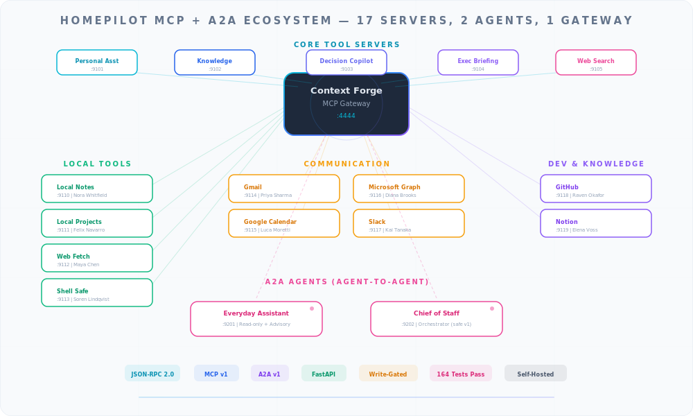

<p align="center">
  
</p>

# MCP Local Notes

**Persistent, human-readable memory for AI Personas.**

| | |
| :--- | :--- |
| **Server name** | `homepilot-local-notes` |
| **Default port** | `9110` |
| **Persona** | Nora Whitfield — *Memory Keeper* |
| **Role** | `assistant` |
| **Protocol** | JSON-RPC 2.0 (MCP v1) |

---

## What It Does

The Local Notes MCP server gives your AI Persona a place to store and retrieve human-readable notes. Think of it as a private notebook that your Persona can search, read, create, update, and delete — all through the standard MCP (Model Context Protocol) interface.

Notes are searchable across titles, content, and tags. Write operations are gated behind environment variables so you stay in control of what the Persona can modify.

---

## Tools

| Tool | Description | Write-Gated |
| :--- | :--- | :---: |
| `hp.notes.search` | Search notes by query across titles, content, and tags | No |
| `hp.notes.read` | Read a note by its ID | No |
| `hp.notes.create` | Create a new note with title, content, and optional tags | Yes |
| `hp.notes.append` | Append content to an existing note | Yes |
| `hp.notes.update` | Replace the content of an existing note | Yes |
| `hp.notes.delete` | Delete a note by ID | Yes |

### Tool Details

**`hp.notes.search`**
```json
{
  "query": "meeting notes",
  "limit": 20
}
```
- `query` (string, required) — Search query
- `limit` (integer, 1–100, default 20) — Maximum results to return

**`hp.notes.create`**
```json
{
  "title": "Weekly standup notes",
  "content": "Discussed roadmap priorities...",
  "tags": ["meetings", "engineering"]
}
```
- `title` (string, required) — Note title
- `content` (string, required) — Note body
- `tags` (array of strings, optional) — Categorization tags

---

## Installation

### Prerequisites

- Python 3.10 or later
- [uv](https://github.com/astral-sh/uv) package manager (recommended) or pip

### Quick Start

```bash
cd agentic/integrations/mcp/local_notes

# Copy environment configuration
cp .env.example .env

# Install dependencies into isolated virtual environment
make install

# Run the server
make run
```

The server starts on `http://0.0.0.0:9110` by default.

### Manual Installation

```bash
cd agentic/integrations/mcp/local_notes
python -m venv .venv
source .venv/bin/activate
pip install -e ".[dev]"
uvicorn agentic.integrations.mcp.local_notes_server:app --host 0.0.0.0 --port 9110 --reload
```

---

## Configuration

Edit `.env` or set environment variables:

| Variable | Default | Description |
| :--- | :--- | :--- |
| `PORT` | `9110` | Server port |
| `HOST` | `0.0.0.0` | Bind address |
| `WRITE_ENABLED` | `false` | Enable write operations (create, update, delete) |
| `DRY_RUN` | `true` | When writes are disabled, indicate dry-run mode in responses |
| `NOTES_STORAGE_DIR` | `./data/notes` | Directory for note storage |

### Safety Model

All write operations (`create`, `append`, `update`, `delete`) are gated by the `WRITE_ENABLED` flag. When `WRITE_ENABLED=false` (the default), any write attempt returns an informational message explaining that writes are disabled. This follows HomePilot's three-level safety model:

- **Level 0 (Read-Only)**: `search` and `read` always work
- **Level 1 (Confirm)**: Write tools require `WRITE_ENABLED=true`
- **Level 2 (Autonomous)**: Set both `WRITE_ENABLED=true` and `DRY_RUN=false`

---

## Testing

```bash
make test
```

Runs the test suite with pytest. Tests cover health checks, MCP protocol compliance, tool invocations, and error handling.

---

## API Endpoints

| Endpoint | Method | Description |
| :--- | :--- | :--- |
| `/health` | GET | Health check (returns `{"status": "ok"}`) |
| `/rpc` | POST | JSON-RPC 2.0 endpoint for MCP protocol |

### Example: Call a Tool via JSON-RPC

```bash
curl -X POST http://localhost:9110/rpc \
  -H "Content-Type: application/json" \
  -d '{
    "jsonrpc": "2.0",
    "id": "1",
    "method": "tools/call",
    "params": {
      "name": "hp.notes.search",
      "arguments": {"query": "meeting"}
    }
  }'
```

---

## Project Structure

```
local_notes/
├── app.py            # Server implementation and tool definitions
├── pyproject.toml    # Dependencies and project metadata
├── Makefile          # Install, test, run, clean, lint targets
├── .env.example      # Configuration template
├── __init__.py
└── tests/            # Test suite
```

---

## Part of the HomePilot Ecosystem

This server is one of 17 MCP tool servers in the HomePilot platform. It connects through the **Context Forge** gateway (port 4444) and can be used by any HomePilot Persona in linked mode.

<p align="center">
  
</p>

---

<p align="center">
  <b>HomePilot</b> — Your AI. Your data. Your rules.<br>
  <a href="https://github.com/ruslanmv/HomePilot">GitHub</a> · <a href="../../../../docs/INTEGRATIONS.md">Integrations Guide</a>
</p>
