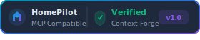

<p align="center">
  
</p>

# MCP Slack

**Read channels, search messages, and post to Slack workspaces.**

| | |
| :--- | :--- |
| **Server name** | `homepilot-slack` |
| **Default port** | `9117` |
| **Persona** | Kai Tanaka — *Comms Specialist* |
| **Role** | `assistant` |
| **Protocol** | JSON-RPC 2.0 (MCP v1) |

---

## What It Does

The Slack MCP server connects your AI Persona to your Slack workspace. It can list channels, retrieve message history, search across messages, and post to channels — with write operations gated by environment configuration.

This is what enables: *"Kai, post the weekly update to #engineering."*

---

## Tools

| Tool | Description | Write-Gated |
| :--- | :--- | :---: |
| `hp.slack.channels.list` | List Slack channels in the workspace | No |
| `hp.slack.channel.history` | Get message history for a channel | No |
| `hp.slack.messages.search` | Search Slack messages | No |
| `hp.slack.message.post` | Post a message to a channel | Yes |

### Tool Details

**`hp.slack.channel.history`**
```json
{
  "channel_id": "C01ABC123",
  "since": "2026-02-17T00:00:00Z",
  "until": "2026-02-18T00:00:00Z",
  "limit": 50
}
```
- `channel_id` (string, required) — Slack channel ID
- `since` / `until` (string, optional) — ISO 8601 time bounds
- `limit` (integer, 1–1000, default 100) — Maximum messages

**`hp.slack.message.post`**
```json
{
  "channel_id": "C01ABC123",
  "text": "Weekly update: deployment completed successfully."
}
```

---

## Installation

### Prerequisites

- Python 3.10 or later
- Slack app with Bot Token (`xoxb-...`)
- Required scopes: `channels:read`, `channels:history`, `search:read`, `chat:write`

### Quick Start

```bash
cd agentic/integrations/mcp/slack

cp .env.example .env
# Edit .env with your Slack Bot Token
make install
make run
```

The server starts on `http://0.0.0.0:9117` by default.

### Slack App Setup

1. Go to [api.slack.com/apps](https://api.slack.com/apps) and create a new app
2. Under **OAuth & Permissions**, add scopes: `channels:read`, `channels:history`, `search:read`, `chat:write`
3. Install the app to your workspace
4. Copy the Bot User OAuth Token (`xoxb-...`)
5. Set `SLACK_BOT_TOKEN` in `.env`

---

## Configuration

| Variable | Default | Description |
| :--- | :--- | :--- |
| `PORT` | `9117` | Server port |
| `WRITE_ENABLED` | `false` | Enable message posting |
| `DRY_RUN` | `true` | Dry-run mode indicator |

---

## Testing

```bash
make test
```

---

## Project Structure

```
slack/
├── app.py            # Server implementation with Slack API integration
├── pyproject.toml    # Dependencies
├── Makefile          # Install, test, run, clean, lint targets
├── .env.example      # Configuration template
├── __init__.py
└── tests/            # Test suite
```

---

## Part of the HomePilot Ecosystem

This server is one of 17 MCP tool servers in the HomePilot platform. It connects through the **Context Forge** gateway (port 4444).

---

<p align="center">
  <b>HomePilot</b> — Your AI. Your data. Your rules.<br>
  <a href="https://github.com/ruslanmv/HomePilot">GitHub</a> · <a href="../../../../docs/INTEGRATIONS.md">Integrations Guide</a>
</p>
