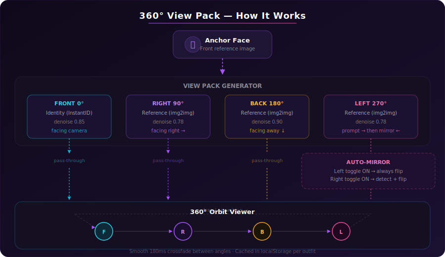

# 360° View Pack — Multi-Angle Character Viewer

Avatar Studio now supports **360° orbit viewing** — a pseudo-3D rotation system that generates four discrete angle views of your character and lets you drag or arrow-key through them with smooth crossfade transitions.

---

## How It Works

The system generates **four views** (Front, Right, Back, Left) from a single anchor face using angle-specific prompts and identity-preserving pipelines, then stitches them into an interactive orbit strip.

<p align="center">
  
</p>

### Pipeline Overview

```
┌──────────────┐
│  Anchor Face  │   Your character's front-facing reference image
└──────┬───────┘
       │
       ▼
┌──────────────────────────────────────────────────────────────┐
│                   View Pack Generator                        │
│                                                              │
│  ┌─────────┐  ┌─────────┐  ┌─────────┐  ┌─────────┐       │
│  │  FRONT  │  │  RIGHT  │  │  BACK   │  │  LEFT   │       │
│  │identity │  │ref 0.78 │  │ref 0.90 │  │ref 0.78 │       │
│  │dn=0.85  │  │dn=0.78  │  │dn=0.90  │  │dn=0.78  │       │
│  └────┬────┘  └────┬────┘  └────┬────┘  └────┬────┘       │
│       │             │            │             │             │
│       │             │            │        ┌────▼─────┐      │
│       │             │            │        │ Auto-    │      │
│       │             │            │        │ Mirror?  │      │
│       │             │            │        └────┬─────┘      │
│       ▼             ▼            ▼             ▼             │
│  ┌─────────┐  ┌─────────┐  ┌─────────┐  ┌─────────┐       │
│  │  0°     │  │  90°    │  │  180°   │  │  270°   │       │
│  │  Front  │  │  Right  │  │  Back   │  │  Left   │       │
│  └─────────┘  └─────────┘  └─────────┘  └─────────┘       │
└──────────────────────────────────────────────────────────────┘
       │             │            │             │
       ▼             ▼            ▼             ▼
┌──────────────────────────────────────────────────────────────┐
│                  360° Orbit Viewer                            │
│                                                              │
│   ← drag / arrow keys →    smooth 180ms crossfade            │
│                                                              │
│   Front ──→ Right ──→ Back ──→ Left ──→ Front (loop)        │
└──────────────────────────────────────────────────────────────┘
```

---

## The Four Angles

| Angle | Denoise | Mode | Prompt Strategy |
|-------|---------|------|-----------------|
| **Front** (0°) | 0.85 | Identity (InstantID) | `front view, facing camera` — highest fidelity |
| **Right** (90°) | 0.78 | Reference (img2img) | `(right profile view:1.5), facing right` — reliable direction |
| **Back** (180°) | 0.90 | Reference (img2img) | `(rear view:1.4), facing away, back of head` — strong prompt override |
| **Left** (270°) | 0.78 | Reference (img2img) | Generates right-facing then mirrors (when auto-mirror ON) |

### Generation Modes

- **Identity** — Uses InstantID face preservation. Best for front view where facial features must match exactly.
- **Reference** — Uses img2img with the front face as reference. Denoise controls how much the angle prompt overrides the reference (higher = more prompt control, less color preservation).

---

## Auto-Mirror Controls

Stable Diffusion reliably generates right-facing profiles but often confuses left/right. The auto-mirror system solves this with **per-direction toggles**:

### Auto-Mirror Left (Default: ON)

When enabled:
1. Generates a **right-facing** image (reliable prompt)
2. Backend **always mirrors** the result horizontally
3. Produces a correct **left-facing** output

When disabled:
- Sends a left-facing prompt directly — may face wrong direction

### Auto-Mirror Right (Default: OFF)

When enabled:
- Backend uses **InsightFace detection** to verify orientation
- Mirrors only if the face direction is wrong (rare safety net)

When disabled:
- Right-facing prompt is used as-is — already reliable, no fix needed

```
  Auto-Mirror LEFT = ON (default)          Auto-Mirror LEFT = OFF
  ┌──────────────────────────┐            ┌──────────────────────────┐
  │ Prompt: "facing right"   │            │ Prompt: "facing left"    │
  │         ↓                │            │         ↓                │
  │ SD generates: → (right)  │            │ SD generates: → or ←    │
  │         ↓                │            │         ↓                │
  │ Backend mirrors: ← (left)│            │ Used as-is (may be wrong)│
  │         ↓                │            │         ↓                │
  │ Result: ← CORRECT ✓     │            │ Result: ← or → (luck)   │
  └──────────────────────────┘            └──────────────────────────┘
```

---

## Per-Angle Tuning

Fine-tune each angle's generation from **Advanced Settings → View Angle Tuning**:

| Parameter | Range | What It Controls |
|-----------|-------|------------------|
| **Denoise** | 0.50 – 1.00 | How much the prompt overrides the reference. Lower = keep colors, higher = follow angle prompt |
| **Prompt Weight** | 1.0 – 2.0 | CLIP emphasis multiplier on the angle directive. Higher = stronger angle enforcement |

**Defaults:**

| Angle | Denoise | Prompt Weight |
|-------|---------|---------------|
| Left  | 0.78    | 1.4           |
| Right | 0.78    | 1.5           |
| Back  | 0.90    | 1.4           |

---

## Orbit Viewer Interaction

### Mouse / Touch
- **Horizontal drag** (80 px per step) rotates clockwise through angles
- **Click angle dots** at bottom-right to jump directly to an angle
- **Hover center** to reveal the lightbox (fullscreen) button

### Keyboard
- **→ Arrow Right** — next angle clockwise
- **← Arrow Left** — previous angle counter-clockwise

### Visual Indicators
- **360° badge** (top-left) — shows current angle label and availability count (e.g., "3/4")
- **Angle dots** (bottom-right) — cyan = active, white = available, dim = not generated
- **Drag hint** — "← → drag to rotate" appears on hover

---

## View Sources

Generate view packs from different character states:

| Source | Description | Cache Key |
|--------|-------------|-----------|
| **Anchor** | Character's original face | `{charId}_anchor` |
| **Latest** | Most recent outfit generation | `{charId}_out_{hash}` |
| **Equipped** | Currently equipped wardrobe item | `{charId}_eq_{outfitId}` |

Switching sources loads cached angles instantly from localStorage.

---

## Settings

| Setting | Default | Description |
|---------|---------|-------------|
| `orbit360Default` | `true` | Start in 360° orbit mode instead of static front view |
| `autoMirrorLeft` | `true` | Auto-mirror left view (right prompt + flip) |
| `autoMirrorRight` | `false` | Auto-mirror right view (InsightFace detection) |
| `viewAngleTuning` | (see above) | Per-angle denoise and prompt weight overrides |

---

## Key Files

| File | Purpose |
|------|---------|
| `frontend/src/ui/avatar/viewPack.ts` | Angle definitions, prompt builders, tuning defaults |
| `frontend/src/ui/avatar/useViewPackGeneration.ts` | Generation hook, caching, deletion |
| `frontend/src/ui/avatar/AvatarOrbitViewer.tsx` | 360° drag/keyboard viewer with crossfade |
| `frontend/src/ui/avatar/AvatarViewPackPanel.tsx` | UI panel for angle selection and progress |
| `frontend/src/ui/avatar/AvatarSettingsPanel.tsx` | Auto-mirror toggles, angle tuning sliders |
| `backend/app/avatar/outfit.py` | Backend orientation fix (mirror + detection) |
