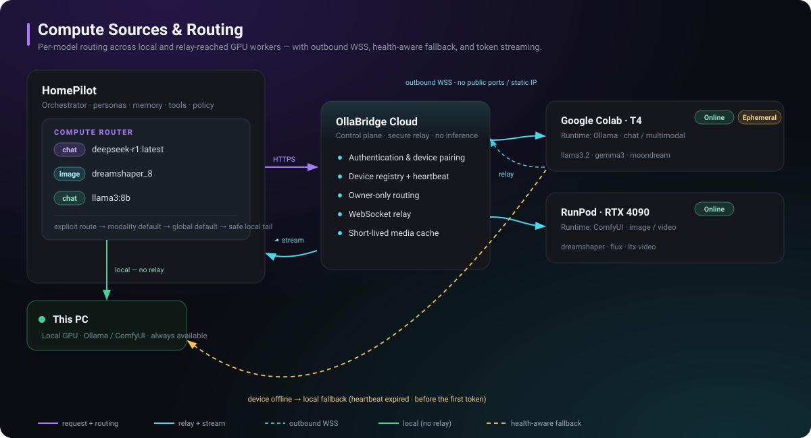
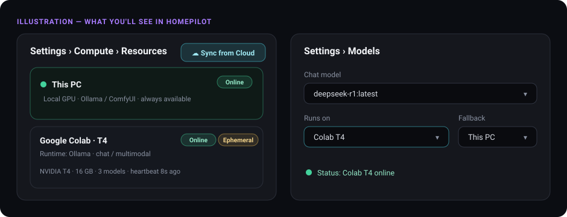

# Connect a GPU to HomePilot — step by step

**Goal:** run HomePilot on your own computer, but do the heavy AI work on a
powerful GPU somewhere else — a **free Google Colab**, a **RunPod** rental, or an
**AWS/GCP/Azure** cloud machine — and pick which model runs where.

You do **not** need to be a developer. No port forwarding, no firewall changes,
no scary networking. If you can copy-paste and click a button, you can do this.

<p align="center">
  
</p>

**The idea in one sentence:** your HomePilot talks to **OllaBridge Cloud** (a free
switchboard), and your GPU quietly "dials in" to the same switchboard — so the two
find each other without you opening anything on your network.

---

## The one golden rule 🔑

> **Sign in to the *same* OllaBridge account in two places:**
> **(1) inside HomePilot, and (2) on the GPU machine.**
> That shared account is the only thing that links them together.

Create your free account once at **https://app.ollabridge.com** (sign up),
then use it in both places below.

---

## What you'll need (2 minutes)

1. **HomePilot** running on your computer. (See the main README to install it.)
2. A **free OllaBridge account** — https://app.ollabridge.com
3. **A GPU**, one of:
   - **Google Colab** — free, great to start, but the session ends after a while.
   - **RunPod** — cheap rental, stays on as long as you want.
   - **AWS / GCP / Azure / Vast.ai** — any cloud machine that has an NVIDIA GPU.

Pick one option below. They all follow the same three moves: **install → pair →
connect.**

---

## Option 1 — Google Colab (free, start here) 🟢

Colab gives you a free GPU in your browser. Perfect for trying this out.

### Step 1 — Open the ready-made notebook

Click this badge (it opens a HomePilot notebook in Colab):

[](https://colab.research.google.com/github/ruslanmv/ollabridge/blob/main/notebooks/homepilot_colab_node.ipynb)

> Not opening? Go to https://colab.research.google.com → **File → Open notebook →
> GitHub**, paste `ruslanmv/ollabridge`, and choose `notebooks/homepilot_colab_node.ipynb`.

### Step 2 — Turn the GPU on

In Colab's top menu: **Runtime → Change runtime type → Hardware accelerator → T4
GPU → Save.** (This is free.)

### Step 3 — Fill in the top box, then run each cell

At the top of the notebook there's a small settings box. Set:

- **CLOUD_URL** — leave it as `https://app.ollabridge.com`
- **RUNTIME** — `chat` (for text) — or `image` / `video` for pictures/videos
- **MODELS** — e.g. `llama3.2:3b, qwen2.5:0.5b`

Then run the cells one by one (click the ▶ on each, top to bottom). They install
everything and download your chosen models.

### Step 4 — Pair (this is the fun part)

When you run the **pairing** cell, it prints a short code and a link:

```text
User code:  ABCD-1234
Verify at:  https://app.ollabridge.com/link
Waiting for approval...
```

Open that link in a new tab, **sign in to OllaBridge**, type the code
`ABCD-1234`, and click **Approve**. Back in Colab you'll see:

```text
✅ Paired successfully
```

### Step 5 — Connect and leave it running

Run the **connect** cell. It shows:

```text
✅ Cloud device online   —   keep this cell running
```

That's it — your Colab GPU is now online and waiting. **Leave this Colab tab
open.** (If you close it or it times out, the GPU simply goes offline and
HomePilot falls back to your PC — nothing breaks.)

➡️ **Now jump to [“Use it in HomePilot”](#use-it-in-homepilot-the-payoff-) below.**

---

## Option 2 — RunPod (paid, always on) 🟣

RunPod rents you a GPU that stays on. Same three moves, done in a terminal.

1. Sign in at **runpod.io** → **Deploy** a GPU Pod (an RTX 4090 or A100 is plenty).
   Pick a template that includes **Ubuntu + CUDA** (any "PyTorch" template works).
2. Open the Pod's **Web Terminal** (a button in the RunPod dashboard).
3. Paste these five lines and press Enter:

```bash
curl -fsSL https://ollama.com/install.sh | sh        # install the model runner
pip install -U ollabridge                            # install the connector
ollama serve >/tmp/ollama.log 2>&1 &                 # start it in the background
ollama pull llama3.2:3b                               # download a model
ollabridge-node cloud-pair --cloud https://app.ollabridge.com --runtime http://127.0.0.1:11434
```

4. The last line prints a **code + link** (just like Colab Step 4). Open the link,
   sign in, enter the code, **Approve**.
5. Finally, keep it connected:

```bash
ollabridge-node cloud-connect --cloud https://app.ollabridge.com --runtime http://127.0.0.1:11434
```

Leave that command running. Your RunPod GPU is now online for HomePilot.

> 💡 It stays online (and billing runs) until you **stop the Pod** in RunPod.
> Stop it when you're done to avoid charges.

---

## Option 3 — AWS, GCP, Azure, or any GPU cloud VM ☁️

Any Ubuntu machine with an NVIDIA GPU works — it's the *exact same five lines* as
RunPod.

1. Launch a **GPU instance**:
   - **AWS:** an EC2 `g4dn.xlarge` or `g5.xlarge`, using the **Deep Learning AMI**
     (it already has NVIDIA drivers).
   - **GCP / Azure:** any GPU VM with an NVIDIA driver image.
2. **Connect** to it (SSH, or the cloud console's "Connect" button).
3. Run the **same five lines** from Option 2, then `cloud-connect`.
4. Approve the code in your browser. Done.

> If `nvidia-smi` prints an error, your machine doesn't see the GPU yet — pick a
> GPU image/AMI that includes the NVIDIA driver, or install it, then retry.

---

## Use it in HomePilot (the payoff) 🎉

Back in **HomePilot** (make sure you're signed in to the **same** OllaBridge
account):

1. Go to **Settings → Compute → Resources** and click **☁ Sync from Cloud**.
   Your GPU appears as **Online** (with its name, VRAM, and a live heartbeat).
2. Go to **Settings → Models**. Beside a model, set **“Runs on” → your GPU**, and
   optionally **“Fallback” → This PC**.
3. Chat as normal. Under the reply you'll see a small **“Ran on Colab T4”** tag —
   proof it ran on the GPU, not your laptop.

<p align="center">
  
</p>

**If the GPU goes offline** (a Colab session ends, a Pod is stopped), HomePilot
notices the missing heartbeat and automatically uses your **Fallback** — you'll
see **“Fell back to This PC · Colab T4 offline”**. Your chat keeps working.

---

## If something goes wrong 🛟

| What you see | What to do |
| ------------ | ---------- |
| Colab says **no GPU** | Runtime → Change runtime type → **T4 GPU** → Save, then re-run. |
| The pairing **code expired** | Just run the pairing step again to get a fresh code. |
| Device **doesn't appear** in HomePilot | Click **Sync from Cloud**. Double-check you signed into the **same** OllaBridge account in both places (the golden rule 🔑). |
| Device shows **Offline** | Colab sessions time out; re-open the notebook and re-run. HomePilot uses your PC in the meantime. |
| "Requires more VRAM" next to a model | That model is too big for that GPU — pick a smaller model, or a bigger GPU. |

---

## Advanced — going to production 🔒

Fine for a personal setup out of the box. Before exposing HomePilot to other
people or the internet, set these and re-check:

> Hit **`GET /compute/readiness`** — it returns `production_ready` plus per-item
> `checks` and plain-language `warnings`. Ship only when it's green.

| Env var | Why |
| ------- | --- |
| `HOMEPILOT_COMPUTE_SECRET_KEY` | Fernet key — encrypts saved endpoint **credentials** at rest (install `cryptography`). |
| `HOMEPILOT_CLOUD_TOKEN_KEY` | Fernet key — encrypts the per-user **cloud token** at rest. |
| `API_KEY` | Requires auth on the OpenAI-compatible ingress from off-localhost clients. |
| `OLLABRIDGE_CLOUD_URL` | Keep the canonical `https://app.ollabridge.com` (or your self-hosted Cloud). |
| `HOMEPILOT_COMPUTE_BLOCK_PRIVATE` | Optional `true` to also block private/LAN endpoints (default allows them for self-hosted GPUs). |

**What's already enforced:** credentials stay server-side (never in the browser);
custom endpoint URLs are checked so the cloud metadata service and link-local
addresses can't be reached (SSRF guard); automatic fallback only happens *before
the first token*, so a streamed reply never restarts on another device.

**Known limitation:** the compute registry is **single-tenant** today — all
linked users share one set of sources/devices/routes. For a multi-tenant SaaS,
scope the registry per user before onboarding untrusted tenants. Single-owner and
team deployments are unaffected.
