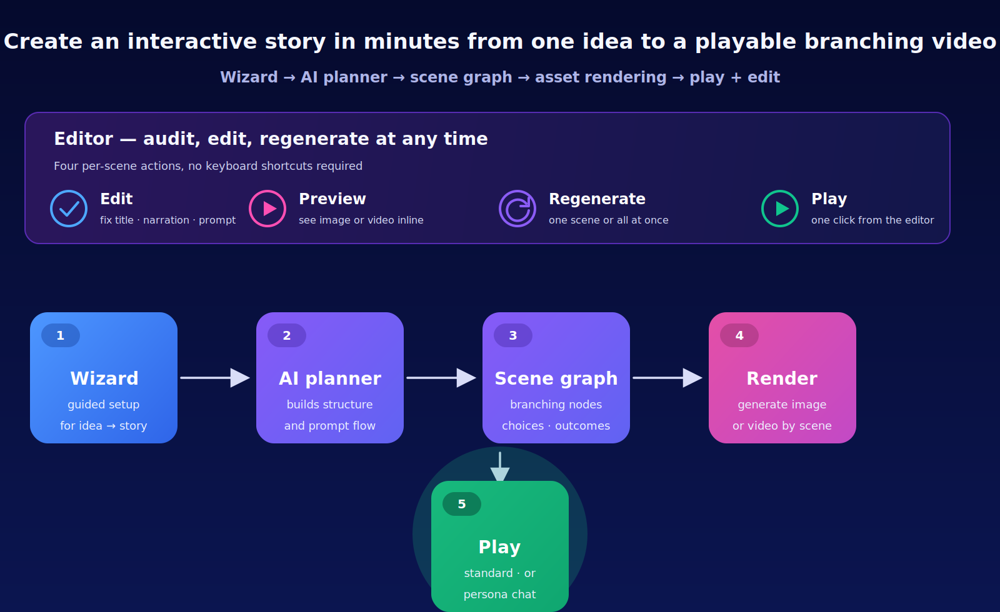

  

  <b>INTERACTIVE</b> 
  <em>Turn one sentence into a branching AI video you can play, edit, and share.</em>

  
  
  
  

---

## What is Interactive?

**Interactive** lets anyone build a branching video — the kind where the viewer makes choices and the story adapts — just by writing one sentence.

Under the hood, HomePilot splits that sentence into seven tiny questions for an AI assistant ("What kind of story is this?", "Who is it for?", "How many choices?"), then stitches the answers into a scene graph: a set of short video or image scenes connected by choices. The viewer plays it in a YouTube-style player with "What to do next?" decision cards, or — if you picked a persona — in a chat-plus-video layout inspired by candy.ai.

You don't need to know anything about AI models, ComfyUI, or graph theory. The wizard takes your idea, the Editor lets you tweak anything you don't like, and the Play button runs the whole thing.

---

## Two kinds of Interactive

<table>
<tr>
<td width="50%" valign="top">

### Standard project

A YouTube-style branching video. Each scene plays for a few seconds, then a decision card asks the viewer to pick what happens next.

- Great for training, education, product tours, quizzes, "choose your adventure" content.
- Viewers see large controls: **Play / Pause**, skip back/forward 10s, a seek bar, fullscreen, and next-scene arrow.
- Decisions appear as image-card choices in a dimmed modal — the viewer taps one and the player jumps to the next scene.

</td>
<td width="50%" valign="top">

### Persona live play

A candy.ai-style experience built around a persona you already created in the Avatar tab. Chat + video move together.

- The video stage loops your persona's avatar; the viewer chats via an "Ask Anything" box.
- A floating joystick button opens a **Live Action** sheet with unlockable actions ("I tease you slowly", "Pull an ahegao face", etc.).
- XP + Levels gate deeper actions, with an optional "Skip to Level N" coin shortcut.
- Needs a persona picked in Step 0 of the wizard.

</td>
</tr>
</table>

---

## Image or Video — pick your GPU budget

Every project can render either **still images** or **full video clips** per scene. You choose on Step 0 of the wizard:

- **Video (full)** — uses your configured video model (SVD / Wan / Seedream in Settings → Providers). Higher GPU cost, higher fidelity.
- **Image (feasibility)** — uses your image model (SDXL / DreamShaper / Pony XL). Fast, lightweight, great when you want to verify the whole workflow on a laptop GPU before committing to video.

The player renders `` or `<video>` automatically based on what the scene actually produced — no two code paths to maintain.

---

## Getting Started (no IT background required)

### 1. Turn it on (once per install)

In **Settings → Providers**:

- Make sure **Chat Model** is set (e.g. `llama3:8b` via Ollama, or any model your Chat Provider lists).
- Set **Image Model** (e.g. `dreamshaper_8.safetensors`) and **Video Model** (e.g. `svd_xt_1_1.safetensors`).
- To actually produce pixels, set the environment variable `INTERACTIVE_PLAYBACK_RENDER=true` before starting HomePilot. Without it, the wizard still creates the story graph but scenes stay as text-only placeholders (which is fine if you just want to author first and render later).

> 💡 The wizard is honest about this. If render is off, the creation modal says "Skipping asset generation — your scenes are ready to edit" instead of faking a full progress bar. You can flip the flag later and use the Editor's **Regenerate** buttons to fill in the visuals.

### 2. Open the Interactive tab

Click **Interactive** in the sidebar. On the first visit you'll see a landing grid — it's empty until you create your first project.

### 3. Click "+ New interactive"

A single box appears that asks "What do you want to build?". Type one sentence. Examples that work well:

- *"Train new sales reps on our three pricing tiers with quizzes at the end of each path."*
- *"Teach a beginner the basics of photosynthesis with a branching explainer."*
- *"Walk a new hire through our onboarding checklist."*
- *"Help a viewer practice simple Spanish greetings in conversation."*

Before you click **Generate**, pick two quick options:

| Option | What it does |
|---|---|
| **Interaction type** | `Standard project` for branching video · `Persona live play` for chat + video with an existing avatar |
| **Render media** | `Video (full)` or `Image (feasibility)` — you can change your mind later |

Hit **Generate**.

### 4. Edit the draft

In a few seconds, the AI gives you a full draft — title, brief, audience, branch shape, choice labels, seed intents. Anything you don't like, just edit in place before confirming. When it looks right, click **Create**.

### 5. Watch the modal

A progress modal opens with a checklist:

1. Saving your project
2. Drafting the scene graph
3. Writing dialogue + choices
4. Rendering scenes *(the big one)*
5. Opening the editor

For the rendering step, you'll see *"Now rendering: Pick your path"* and a live progress bar — `6 / 12 scenes`. If rendering is off, you'll see an amber hint pointing you at Settings.

### 6. Edit + Preview + Regenerate in the Editor

When the editor opens, each scene row has three small icons:

- ✏️ **Edit** — inline form to change title, narration, or image prompt.
- ▶️ **Preview** — pops up the rendered image or video.
- 🔄 **Regenerate** — re-renders just that scene. Great when one scene is weird but the rest is fine.

The header has a bigger **Regenerate all (N missing)** button that shows up whenever any scene still has no asset (e.g. you just turned on the render flag after creation).

### 7. Play

Top-right **Play** button launches the full experience. Share the URL or embed it elsewhere once it passes QA.

---

## The Editor tabs

| Tab | Purpose |
|---|---|
| **Graph** | The scenes, transitions, and per-scene edit/preview/regenerate actions (most-used tab). |
| **Catalog** | Action catalog — what viewers can trigger during play (choices, unlocks, XP awards). |
| **Rules** | Personalization rules that adjust scenes based on viewer mood / affinity / XP. |
| **QA** | Automated readiness checks — broken edges, missing assets, policy conflicts. |
| **Publish** | Push to web embed / studio preview / export / LMS / kiosk / API. |
| **Analytics** | Session counts, completion rate, per-decision fork rates. |

---

## FAQ

**Does it work without an internet connection?**
Yes, if your Chat Model (e.g. Ollama) and ComfyUI are local. HomePilot never requires a cloud round-trip for the core flow.

**What if my GPU is small?**
Pick **Image** render media. A scene generates in ~2–5 seconds on a modest card. You get the full branching story; the visuals are stills instead of clips.

**I created a project with rendering off. Did I waste it?**
No. Your scene graph, dialogue, and choices are all saved. Turn `INTERACTIVE_PLAYBACK_RENDER=true` on, open the Editor, and click **Regenerate all (N missing)** at the top of the Graph tab. Every empty scene will render in one sweep.

**Can I edit a single scene's narration without regenerating?**
Yes. ✏️ **Edit** only updates text; the asset stays the same. Use 🔄 **Regenerate** when you want new pixels.

**How does the AI know what to write?**
It doesn't make it up from scratch. The planner asks seven tiny questions (classify mode, extract topic, title, brief, audience, shape, seed intents), each answerable by a small local LLM like `llama3:8b` or even `qwen3:1.5b`. Prompts live in plain YAML under `backend/app/interactive/prompts/` — you can read them, audit them, or swap them out without touching Python.

**Can I use both Image and Video in the same project?**
Today the choice is project-wide. If you want some scenes to be video and others to be stills, create two projects; a future release will let you pick per scene.

---

## Where the code lives

| Concern | Where |
|---|---|
| Wizard one-box entry | `frontend/src/ui/interactive/WizardAuto.tsx` |
| Draft review screen | `frontend/src/ui/interactive/WizardAutoPreview.tsx` |
| Editor shell | `frontend/src/ui/InteractiveEditor.tsx` |
| Graph panel (edit/preview/regenerate) | `frontend/src/ui/interactive/GraphPanel.tsx` |
| Standard player | `frontend/src/ui/interactive/StandardPlayer.tsx` |
| Persona player | `frontend/src/ui/InteractivePlayer.tsx` |
| Stage-1 planner | `backend/app/interactive/planner/autoplan_workflow.py` |
| Stage-2 graph generator | `backend/app/interactive/planner/autogen_workflow.py` |
| Scene render pipeline | `backend/app/interactive/playback/render_adapter.py` |
| Prompt library (YAML) | `backend/app/interactive/prompts/` |
| HTTP routes | `backend/app/interactive/routes/` |

---

## Troubleshooting

| Symptom | Fix |
|---|---|
| Modal says "Skipping asset generation" | Set `INTERACTIVE_PLAYBACK_RENDER=true` in your env and restart; then click **Regenerate all** in the Editor. |
| Scene narration looks generic | Click ✏️ **Edit** on the row and tighten it. Click **Save** — no regeneration needed for text changes. |
| Rendered image is wrong | Click ✏️ **Edit** → adjust **Image prompt**, Save, then 🔄 **Regenerate** just that scene. |
| Player shows a gradient instead of video | That scene has no asset. Click 🔄 **Regenerate** on the row (or **Preview** to confirm). |
| Live Action sheet is empty | The project has no actions yet. Open the **Catalog** tab and add at least one. |
| "No personas yet" in wizard | Create a persona in the **Avatar** tab first, then return to the Interactive wizard. |

---

  Part of <a href="../README.md">HomePilot</a> · see also <a href="AVATAR.md">Avatar Studio</a>, <a href="MEMORY.md">Memory</a>, <a href="PERSONAS.md">Personas</a>

