# Multimodal Intelligence

HomePilot processes text, images, documents, and voice through four **topologies** — processing modes that stack on top of each other. Pick the one that fits your use case.

<p align="center">
  <br>
  <em>Four topologies — each builds on the layer below.</em>
</p>

---

## Topologies at a Glance

| Topology | Name | What It Does | Best For |
|:---:|:---|:---|:---|
| **T1** | Basic Chat | Direct LLM conversation | Quick questions, brainstorming |
| **T2** | Project Knowledge | Searches your uploaded docs before answering | Research, documentation Q&A |
| **T3** | Agent Tool Use | LLM decides when to use tools (vision, search, memory) | Complex tasks, image analysis |
| **T4** | Knowledge Companion | All tools + user profile + long-term memory + session history | Personal assistant, long-term companion |

---

## T1: Basic Chat

Your message goes straight to the LLM and back. No tools, no databases, no overhead.

**How to use:** Select any persona → type a message → get a response.

**Endpoint:** `POST /chat`

---

## T2: Project Knowledge (RAG)

Upload PDFs, text files, or markdown to a project. When you ask a question, HomePilot searches your documents first, then sends the relevant chunks to the LLM for a grounded answer.

**How to use:**
1. Create a project in the sidebar
2. Upload documents via the upload button
3. Ask questions — the LLM will reference your files

**Endpoint:** `POST /chat` with `project_id`

**Storage:** ChromaDB (local, on-disk vector database)

---

## T3: Agent Tool Use

The LLM becomes an agent that can decide which tools to call. Instead of you choosing what to do, the agent figures it out.

**Available tools:**

| Tool | What It Does |
|:---|:---|
| `vision.analyze` | Analyzes uploaded images (caption, OCR, or both) |
| `knowledge.search` | Searches the project knowledge base |
| `memory.recall` | Retrieves stored facts about you from long-term memory |
| `memory.store` | Saves a new fact the agent learns about you |
| `web.search` | Searches the web for current information |
| `image.index` | Indexes an image into the knowledge base for future search |

**How to use:** Set topology to **Agent** in Settings → the agent will call tools as needed.

**Endpoint:** `POST /v1/agent/chat`

---

## T4: Knowledge Companion

This is T3 with full context awareness. The agent sees everything it needs to act as a persistent companion:

<p align="center">
  <br>
  <em>Every message flows through all available context layers before the agent responds.</em>
</p>

**What the agent knows about you:**
- **User Profile** — your name, preferences, boundaries (from Settings)
- **Session History** — what you discussed in previous sessions
- **Persona Memory** — long-term adaptive memory (facts, preferences, learned context)
- **Knowledge Base** — your uploaded documents and indexed images
- **6 Agent Tools** — vision, search, memory read/write, web, image indexing

**How to use:** Set topology to **Knowledge** in Settings. This activates the full companion mode.

**Endpoint:** `POST /v1/agent/chat` (same as T3, with all context layers injected)

---

## Choosing a Topology

```
Just chatting?                    → T1 (Basic Chat)
Have documents to reference?      → T2 (Project Knowledge)
Need image analysis or web search?→ T3 (Agent)
Want a personal AI companion?     → T4 (Knowledge Companion)
```

You can switch topologies at any time from **Settings → Multimodal Topology**. All your data (projects, memory, documents) is preserved regardless of which topology you use.

---

## Image Support

HomePilot can process images in two ways:

1. **Vision Analysis** (T3/T4) — the agent describes, reads text from, or answers questions about images using a local vision model (e.g., `moondream`, `llava`)
2. **Image Indexing** (T4) — images are analyzed and their content is stored in the knowledge base as searchable text, so you can find them later by description

**Supported formats:** PNG, JPG, JPEG, WebP, GIF, BMP

---

## Technical Notes

- All processing is **local** — nothing leaves your machine
- Every topology is **additive** — T4 includes everything from T1 + T2 + T3
- Context layers are **non-blocking** — if memory or profile is unavailable, the agent works without it
- The agent uses a **JSON protocol** (not function calling), so it works with any Ollama model
- Memory uses **exponential decay + reinforcement** — unused facts fade, accessed facts get stronger
