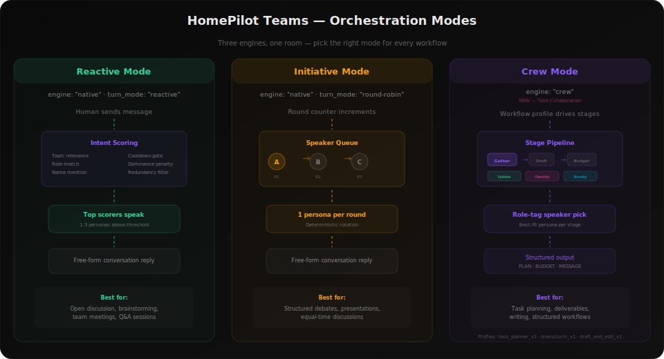
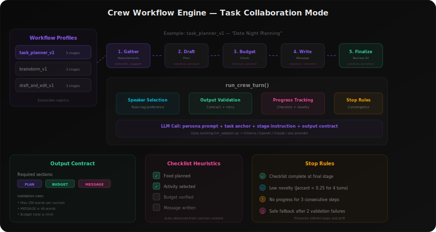

# Teams — Multi-Persona Meeting Rooms

Teams brings your AI personas together in a virtual meeting room where they
collaborate, debate, and build on each other's ideas — just like a real team
meeting.

## Overview

Each meeting room seats your persona agents around a shared table.  You (the
host) type messages and the orchestrator decides **who speaks next** based on
relevance, intent, and conversation dynamics — no rigid round-robin.

```
You send a message  ──>  Orchestrator scores every persona
                              │
                    ┌─────────┴─────────┐
                    │  Intent Scoring    │
                    │  - topic match     │
                    │  - role relevance  │
                    │  - name mentions   │
                    │  - cooldown/domi-  │
                    │    nance gates     │
                    └─────────┬─────────┘
                              │
                   Highest-scoring personas
                   raise their hand and speak
```

## Architecture

The meeting UI is a 3-column layout inspired by Microsoft Teams:

| Left Rail | Center Stage | Right Rail |
|-----------|--------------|------------|
| People sidebar | Oval meeting table with seats | Agenda / Actions / Stats |
| In Meeting list | Overflow gallery strip | Speaking distribution |
| Available personas | Scrollable transcript | Orchestration policy |
| Drag-to-add | Chat-style input bar | Dominance indicators |

### Meeting Table

Personas sit around an oval table (max 6 visible seats).  When more than 6
participants are present, extras appear in a paginated **overflow strip** below
the table.  Drag personas from the strip onto the table to swap seats.

- **Click** an avatar to open the **Persona Profile Panel**
- **Double-click** a seat to **pin** it (pinned seats are never swapped out)
- **Drag** a persona from the left rail onto the table to add them

### Persona Profile Panel

Click any participant's face to open a slide-over character sheet showing
real data from their persona project:

- **Class & Level** — Secretary, Assistant, Companion, Custom, etc.
- **Stats** — Depth, Versatility, Personality, Visual (computed from project richness)
- **Character Sheet** — Tone, Style, Portraits, Wardrobe, Stance, Age
- **Skills** — Image generation, video, document analysis, automation
- **Equipment** — Tool bundles and MCP servers
- **Quest Objective** — The persona's agentic goal

## Orchestration Engines

HomePilot Teams supports two orchestration engines:

| Engine | Policy key | Description |
|--------|-----------|-------------|
| **Native** (default) | `engine: "native"` | Free-form conversation with intent scoring, round-robin, or moderated modes |
| **Crew** | `engine: "crew"` | Stage-based task collaboration with structured output contracts, checklist tracking, and budget validation |

### Orchestration Modes (Native Engine)

| Mode | Behavior |
|------|----------|
| **Reactive** (default) | Intent scoring decides who speaks. Only relevant personas respond. |
| **Round Robin** | Every persona speaks in sequence. Legacy mode. |
| **Moderated** | Host uses **Call On** to pick the next speaker. |
| **Free Form** | All participants may speak freely (low threshold). |

<p align="center">
  
</p>

### Intent Scoring Pipeline

Every time a human message arrives, the orchestrator scores each persona:

| Signal | Weight | Description |
|--------|--------|-------------|
| Baseline | +0.15 | Every persona starts here |
| Name mention | +0.35 | Message mentions the persona by name |
| Question | +0.15 | Message ends with `?` |
| Brainstorm | +0.15 | Keywords: "ideas", "brainstorm", "suggestions" |
| Role relevance | +0.30 | Topic keywords match the persona's role tags |
| Authority boost | +0.10 | "engineer" on code topics, "legal" on compliance, etc. |
| Cooldown | -0.35 | Spoke within last N turns |
| Redundancy | -0.25 | Would repeat what was just said |
| Dominance | -0.15 | Spoke too much in recent history |

Personas scoring above the **speak threshold** (default 0.45) automatically
raise their hand.  The orchestrator picks the top speakers per round and
ensures diversity through redundancy and dominance gates.

### Hand-Raise System

- Auto-raised when confidence >= threshold
- TTL: 2 rounds (configurable)
- Max 3 visible hands at a time
- Visual badges show intent type + TTL countdown

## Turn Modes & Controls

The input bar adapts to the current mode:

- **Call On** — Dropdown to pick a specific persona to speak
- **Run Turn** — Trigger the next orchestration round manually
- **Mute/Unmute** — Muted personas are skipped by the orchestrator

## Crew Workflow Engine (Task Collaboration Mode)

The **Crew engine** (`engine: "crew"`) drives structured, stage-based workflows
where personas collaborate on a concrete deliverable — like planning a date night,
brainstorming product ideas, or drafting a document.

<p align="center">
  
</p>

### How It Works

1. **Set the engine**: `room.policy.engine = "crew"` and choose a workflow profile
2. **Each turn advances one stage** — the engine selects the best persona per stage
   based on role-tag matching (e.g. "romantic" for a date planning stage)
3. **Output contract** — every response must include required sections (e.g. PLAN,
   BUDGET, MESSAGE). Invalid output is retried once, then a safe fallback is used
4. **Checklist tracking** — progress items (food, activity, budget, message) are
   auto-detected from section content
5. **Stop rules** — the workflow stops when the checklist is complete at the final
   stage, novelty drops below threshold, or no progress is made

### Workflow Profiles

| Profile | Stages | Output Sections | Use Case |
|---------|--------|-----------------|----------|
| `task_planner_v1` | Gather → Draft → Budget → Message → Finalize | PLAN, BUDGET, MESSAGE | Date planning, event organization, task management |
| `brainstorm_v1` | Ideate → Evaluate → Finalize | IDEAS, EVALUATION, RECOMMENDATION | Open-ended ideation and idea comparison |
| `draft_and_edit_v1` | Outline → Draft → Edit | OUTLINE, NOTES, DRAFT | Collaborative writing, email drafts, content creation |

### Room Policy Example

```json
{
  "policy": {
    "engine": "crew",
    "crew": {
      "profile_id": "task_planner_v1",
      "budget_limit_eur": 30
    }
  }
}
```

### API Endpoints

| Endpoint | Method | Description |
|----------|--------|-------------|
| `/v1/teams/workflow/profiles` | GET | List available workflow profiles |
| `/v1/teams/rooms/{id}/crew-status` | GET | Get current stage, checklist, progress |
| `/v1/teams/rooms/{id}/react` | POST | Run next crew turn (auto-detects engine) |
| `/v1/teams/rooms/{id}/run-turn` | POST | Run next crew turn (auto-detects engine) |

### Backend Files

| File | Purpose |
|------|---------|
| `crew_profiles.py` | WorkflowProfile registry with built-in profiles |
| `crew_engine.py` | `run_crew_turn()` — stage execution, validation, checklist, novelty |
| `participants_resolver.py` | Role-tag inference for speaker selection |

## Files

| File | Purpose |
|------|---------|
| `TeamsView.tsx` | Top-level router: landing → wizard → room |
| `TeamsLandingPage.tsx` | Session grid with studio-style cards |
| `CreateSessionWizard.tsx` | 3-step wizard: name → personas → mode |
| `MeetingRoom.tsx` | Full 3-column meeting layout |
| `MeetingLeftRail.tsx` | People sidebar with status dots |
| `MeetingRightRail.tsx` | Agenda, actions, stats tabs |
| `MeetingOverflowStrip.tsx` | Paginated gallery for >6 participants |
| `PersonaProfilePanel.tsx` | Slide-over character sheet |
| `PersonaSelectorEnterprise.tsx` | Step 2 persona picker for wizard |
| `types.ts` | Shared TypeScript types |
| `useTeamsRooms.ts` | Hook for room CRUD + orchestration API |
| `backend/app/teams/` | Backend: routes, orchestrator, intent scoring |

## Architecture Diagram

<p align="center">
  
</p>
