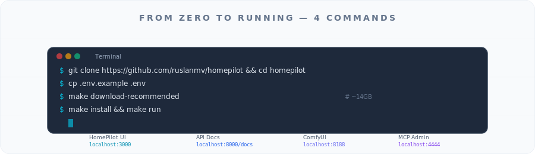
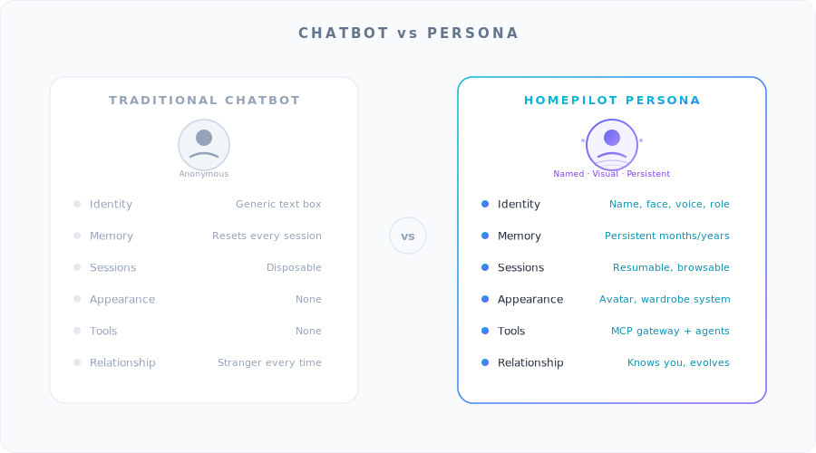

<p align="center">
  
</p>

# HomePilot: The Definitive Guide

**Build a self-hosted AI system with persistent memory, studio-grade content creation, and real-world tool access — running entirely on your hardware.**

*By [Ruslan Magana Vsevolodovna](https://ruslanmv.com/) | February 2026 | 45 min read*

---

## Table of Contents

1. [What Is HomePilot?](#1-what-is-homepilot)
2. [Who This Guide Is For](#2-who-this-guide-is-for)
3. [Key Concepts and Terminology](#3-key-concepts-and-terminology)
4. [The Problem HomePilot Solves](#4-the-problem-homepilot-solves)
5. [Quick Start: Four Commands](#5-quick-start-four-commands)
6. [Architecture Deep Dive](#6-architecture-deep-dive)
7. [Personas: Persistent AI Identities](#7-personas-persistent-ai-identities)
8. [The Memory System](#8-the-memory-system)
9. [Voice Integration](#9-voice-integration)
10. [Choosing Your Language Model](#10-choosing-your-language-model)
11. [Image Generation](#11-image-generation)
12. [The Image Editing Studio](#12-the-image-editing-studio)
13. [Video Animation](#13-video-animation)
14. [Content Creation: Stories, Studios, and TV Mode](#14-content-creation-stories-studios-and-tv-mode)
15. [Sharing Personas with the Community](#15-sharing-personas-with-the-community)
16. [MCP: From Conversation to Action](#16-mcp-from-conversation-to-action)
17. [The Safety Model](#17-the-safety-model)
18. [External Service Connectors](#18-external-service-connectors)
19. [Agent Projects](#19-agent-projects)
20. [End-to-End Walkthrough](#20-end-to-end-walkthrough)
21. [Reference Tables](#21-reference-tables)
22. [Next Steps](#22-next-steps)

---

## 1. What Is HomePilot?

HomePilot is an open-source, self-hosted AI platform that consolidates text generation, image creation, image editing, video animation, and workflow automation into a single system. You install it once. It runs on your machine. All data — conversations, generated images, video, and memory — stays on your local hardware.

Unlike cloud-based AI chat products that reset every session and scatter your data across vendor servers, HomePilot introduces **Personas**: persistent AI identities that remember you across sessions, speak with a consistent voice, and can take real-world actions through a standardized tool protocol.

<p align="center">
  <br>
  <em>Figure 1 — The HomePilot main interface. Chat, generate images, edit photos, and animate video — all within one continuous conversation.</em>
</p>

---

## 2. Who This Guide Is For

This guide is written for four audiences. Each section is labeled so you can skip to what matters most.

| Audience | What You Will Get |
|:---|:---|
| **Content creators** | A complete AI studio — text, image, video, export — with zero monthly subscriptions |
| **Gamers and storytellers** | Visual story generation, branching narratives, cinematic playback, and a World Bible system |
| **Developers and engineers** | A production-ready reference architecture with 160+ API endpoints, modular services, and extensible tool integration |
| **Enterprise teams** | Audit trails, configurable safety policies, content rating enforcement, and zero data exfiltration risk |

Whether you are a solo creator building a YouTube channel or a team of 50 evaluating self-hosted AI, this guide covers installation, daily usage, and the full technical architecture.

---

## 3. Key Concepts and Terminology

Before diving in, here are the acronyms and technical terms used throughout this guide. Every term is defined here on first use, and referenced by its full name at least once in each section.

| Term | Full Name | What It Means |
|:---|:---|:---|
| **LLM** | Large Language Model | The AI model that generates text. Examples: Llama 3, GPT-4o, Claude |
| **MCP** | Model Context Protocol | An open standard for connecting AI assistants to external tools and services |
| **A2A** | Agent-to-Agent | A protocol that allows AI agents to coordinate with each other on multi-step tasks |
| **RAG** | Retrieval-Augmented Generation | A technique where the AI searches your documents before answering, so responses are grounded in your data |
| **SDXL** | Stable Diffusion XL | An open-source image generation model that produces 1024x1024 pixel images natively |
| **FLUX** | FLUX (by Black Forest Labs) | A family of fast, high-quality image generation models |
| **ComfyUI** | ComfyUI | A node-based workflow engine for image and video generation. HomePilot uses it to run 22 generation workflows |
| **LoRA** | Low-Rank Adaptation | A lightweight fine-tuning technique that customizes image models without full retraining |
| **API** | Application Programming Interface | A structured way for software components to communicate. HomePilot exposes 160+ REST API endpoints |
| **CLI** | Command-Line Interface | A text-based interface for running commands in a terminal |
| **CDN** | Content Delivery Network | A network of servers that delivers files quickly to users worldwide |
| **CORS** | Cross-Origin Resource Sharing | A browser security mechanism that controls which websites can request data from your server |
| **SMTP/IMAP** | Simple Mail Transfer Protocol / Internet Message Access Protocol | Standard protocols for sending (SMTP) and receiving (IMAP) email |
| **CalDAV** | Calendar Distributed Authoring and Versioning | An open protocol for calendar synchronization |
| **SQL** | Structured Query Language | The standard language for querying and managing relational databases |
| **CI** | Continuous Integration | Automated testing and validation that runs every time code is pushed |
| **VRAM** | Video Random Access Memory | Memory on your graphics card (GPU). Image and video generation models load into VRAM |
| **FPS** | Frames Per Second | The number of individual frames displayed per second in a video |
| **CFG** | Classifier-Free Guidance | A parameter that controls how closely the generated image follows your text prompt. Higher values produce more literal interpretations |
| **SearXNG** | SearXNG | A privacy-respecting, self-hosted meta-search engine that requires no API keys |

---

## 4. The Problem HomePilot Solves

<p align="center">
  <br>
  <em>Figure 2 — Tool fragmentation. A typical creator in 2026 uses 4–6 separate AI tools, each with its own login, its own data silo, and its own monthly bill.</em>
</p>

A typical AI-assisted creative workflow today looks like this:

1. Open a chat tool and generate text
2. Copy the output, open an image generation tool, paste it as a prompt
3. Download the generated image to your hard drive
4. Upload it to a background removal tool
5. Download the result, upload it to a video animation tool
6. Wait for the render, download the video
7. Upload it to your final destination

That is **7 steps, 4 tools, and 5 file transfers** for a single creative action. Each tool:
- Forgets your context the moment you switch to another
- Stores your data on a different vendor's server, in a different country
- Charges a separate monthly subscription

<p align="center">
  <br>
  <em>Figure 3 — Data sovereignty. Cloud AI scatters your data across multiple vendor servers. HomePilot keeps everything on your local machine, under your control.</em>
</p>

**HomePilot eliminates all of this.** One interface, one conversation, one machine. Your data never leaves your hardware.

---

## 5. Quick Start: Four Commands

<p align="center">
  <br>
  <em>Figure 4 — From zero to running in four commands. HomePilot installs all dependencies, downloads recommended models, and launches every service automatically.</em>
</p>

```bash
git clone https://github.com/ruslanmv/HomePilot.git && cd HomePilot
cp .env.example .env
make download-recommended    # Downloads ~14 GB of AI models
make install && make run
```

Open **http://localhost:3000** in your browser. You should see the main interface (Figure 1).

### What each command does

| Command | Purpose |
|:---|:---|
| `git clone` | Downloads the HomePilot source code from GitHub |
| `cp .env.example .env` | Creates your local configuration file with sensible defaults |
| `make download-recommended` | Downloads an LLM (Large Language Model) for Ollama, the FLUX Schnell image model, and supporting models for face restoration and upscaling |
| `make install && make run` | Installs all dependencies (backend, frontend, ComfyUI workflows) and starts every service |

**If you have limited bandwidth or no GPU:** skip `make download-recommended` and use a cloud LLM provider instead. Open `.env`, set `LLM_PROVIDER=openai`, and add your API key. Image and video generation will be disabled, but conversation, Personas, and MCP (Model Context Protocol) agents will work fully.

### Verification checklist

After installation, confirm these access points are responding:

| Service | URL | Expected |
|:---|:---|:---|
| **HomePilot UI** | `http://localhost:3000` | Main interface loads |
| **API Documentation** | `http://localhost:8000/docs` | Full OpenAPI reference |
| **ComfyUI** | `http://localhost:8188` | Workflow engine interface |

Type a message in the chat. If you receive a response, your LLM is configured correctly and you are ready to continue.

---

## 6. Architecture Deep Dive

<p align="center">
  <br>
  <em>Figure 5 — HomePilot architecture. Each rectangle is an independent service that can be replaced, upgraded, or disabled without affecting the others.</em>
</p>

HomePilot is not a monolith. It is a modular system of independent services orchestrated via Docker:

| Service | Port | Technology | Role |
|:---|:---|:---|:---|
| **Frontend** | 3000 | React 18, Vite, TypeScript, Zustand | User interface: chat, image viewer, story editor, settings |
| **Backend** | 8000 | Python, FastAPI | Central orchestrator. Routes all requests. Exposes 160+ REST API endpoints |
| **Ollama** | 11434 | Go | Local LLM inference. Runs Llama 3 and other models on your hardware |
| **ComfyUI** | 8188 | Python | Node-based workflow engine. Runs 22 JSON workflow files for image and video generation |
| **Media Service** | 8002 | Python, FFmpeg | Video post-processing: encoding, format conversion, thumbnail extraction |
| **MCP Gateway** | 4444 | Python, Context Forge | Model Context Protocol gateway. Manages tool servers and Agent-to-Agent communication |
| **Storage** | — | SQLite, ChromaDB, local disk | Metadata, vector embeddings for RAG (Retrieval-Augmented Generation), and all generated files |

### Design principles

- **Every service binds to `127.0.0.1`** — nothing is exposed to the network by default
- **Zero telemetry** — no analytics, no phone-home, no tracking of any kind
- **Swappable components** — to upgrade image generation capabilities, drop in a new JSON workflow file. No code changes needed
- **Full API coverage** — every operation available in the UI is also available as a documented REST API endpoint at `/docs`

---

## 7. Personas: Persistent AI Identities

<p align="center">
  <br>
  <em>Figure 6 — Traditional chatbot versus HomePilot Persona. A chatbot resets every session. A Persona remembers your preferences, has a consistent voice, and accumulates knowledge over time.</em>
</p>

A Persona is a **persistent AI identity**. It is not a chatbot, not a voice skin, not a prompt template. It has a name, a role, a face, a voice, a personality, and structured long-term memory.

<p align="center">
  <br>
  <em>Figure 7 — The Persona equation. Five ingredients — identity, voice, appearance, memory, and sessions — combine into one persistent AI identity that endures across conversations.</em>
</p>

| Dimension | Traditional Chatbot | HomePilot Persona |
|:---|:---|:---|
| **Identity** | Anonymous, generic | Named, with face, voice, and role |
| **Memory** | Resets every session | Persistent across months and years |
| **Sessions** | One-shot, disposable | Resumable, browsable, searchable |
| **Appearance** | None | AI-generated avatar with wardrobe system |
| **Tools** | None | MCP gateway with real-world tool access |
| **Relationship** | Stranger every time | Knows your preferences, style, and history |

The difference runs deeper than features. A traditional chatbot is a function — you call it, it answers, it disappears. A Persona is an entity that sits *above* individual conversations:

<p align="center">
  <br>
  <em>Figure 8 — Ownership hierarchy. You own your Persona. Your Persona hosts every session — voice, text, or mixed. One consistent identity, many conversations.</em>
</p>

This hierarchy is what makes the next step meaningful — you are not configuring a chatbot, you are instantiating an identity.

### Creating your first Persona

1. Open the sidebar and navigate to **My Projects**
2. Click **New Project** and select **Persona**
3. Walk through the four-tab creation wizard:
   - **Identity** — name, role, personality description, behavioral rules
   - **Appearance** — generate an AI avatar, choose a style preset (realistic, illustrated, minimalist)
   - **Voice** — select a voice persona and speed (see [Section 9](#9-voice-integration))
   - **Tools** — enable MCP tool access if you plan to use agentic features (see [Section 16](#16-mcp-from-conversation-to-action))
4. Click **Create**

Your Persona is now live. Every conversation you have with it builds its memory (see [Section 8](#8-the-memory-system)).

### Built-in personality archetypes

HomePilot ships with **17 ready-to-use archetypes**, each with its own system prompt, behavioral dynamics, and conversation style:

| Archetype | Style | Best For |
|:---|:---|:---|
| **Assistant** | Professional, task-focused | Daily productivity |
| **Storyteller** | Rich narrative, world-building | Creative writing, game development |
| **Code Mentor** | Patient technical teacher | Learning to program |
| **Therapist** | CBT (Cognitive Behavioral Therapy) techniques | Mental wellness, reflection |
| **Meditation Guide** | Calm, centering, breathwork | Stress management |
| **Motivational Coach** | High-energy, action-oriented | Goal setting |
| **Debater** | Structured argumentation | Decision-making, critical thinking |
| **Kids Story Time** | Warm narrator for children | Family content |
| **and 9 more** | Each with unique tone and behavior | Various use cases |

You can use any archetype as-is or customize it to create your own Persona.

---

## 8. The Memory System

<p align="center">
  <br>
  <em>Figure 9 — The four-layer memory system. Persona memory is not a flat log. It is structured into facts, emotional patterns, relationship context, and confidence scoring — all persistent across sessions.</em>
</p>

### Four memory layers

| Layer | What It Stores | Example |
|:---|:---|:---|
| **Facts** | Concrete information: name, timezone, tech stack, preferences | "User prefers bullet points over paragraphs" |
| **Emotional Patterns** | How you communicate under different conditions | "User becomes terse when blocked on a task" |
| **Relationship Context** | Recurring topics, shared projects, working dynamics | "We discuss architecture every Monday" |
| **Confidence Scoring** | How certain the Persona is about each piece of knowledge | High-confidence (stated directly) versus tentative (inferred from context) |

### Building memory in practice

Start a session with your Persona and share information naturally:

> "I am working on a mobile app. I use React Native and deploy to Firebase."

> "My timezone is CET. I usually work from 9 AM to 6 PM."

> "I like concise answers with bullet points, not long paragraphs."

The Persona extracts facts, assigns confidence scores, and stores them. In the next session — even weeks later — ask:

> "What do you remember about my tech stack?"

It will recall React Native, Firebase, and your formatting preferences without being told again.

### Reviewing and editing memory

Navigate to the Persona's **Memory Panel** to view all stored facts, edit individual entries, delete outdated information, and see confidence scores for each memory.

---

## 9. Voice Integration

<p align="center">
  <br>
  <em>Figure 10 — Six built-in voice personas. Each voice can be paired with any Persona identity and adjusted between 0.5x and 2.0x speed.</em>
</p>

HomePilot includes six voice personas. Any voice can be combined with any Persona identity — your "Research Assistant" can use Leo's deep, confident voice, or your "Meditation Guide" can use Eve's calm delivery.

| Voice | Character | Best For |
|:---|:---|:---|
| **Ara** | Clear, warm | General-purpose assistant |
| **Eve** | Calm, precise | Guided meditation, research |
| **Leo** | Deep, confident | Presentations, executive briefings |
| **Rex** | Bold, direct | Coaching, debate |
| **Sal** | Friendly, soft | Kids content, casual conversation |
| **Gork** | Quirky, fun | Gaming, entertainment |

### Starting a voice session

1. Click your Persona card in **My Projects**
2. Select **Voice Session** (instead of Text Session)
3. Speak naturally — the system transcribes your speech, processes it through the LLM, and responds audibly
4. Use the speed slider to adjust playback between 0.5x (slow, deliberate) and 2.0x (fast, efficient)

All sessions — voice and text — are **resumable**, **browsable**, and **non-destructive**. Nothing is lost when you close the browser.

---

## 10. Choosing Your Language Model

The LLM (Large Language Model) is the foundation of every HomePilot feature. Text generation, intent routing, image prompt crafting, and agentic reasoning all flow through it.

| Provider | Best For | API Key Required | Runs Locally |
|:---|:---|:---|:---|
| **Ollama** (default) | Maximum privacy, zero cost, no internet needed | No | Yes |
| **OpenAI** | GPT-4o, strongest general reasoning | Yes | No |
| **Claude (Anthropic)** | Nuanced writing, very long context windows | Yes | No |
| **IBM watsonx** | Regulated industries, enterprise compliance | Yes | No |
| **OpenAI-compatible** | Custom model servers such as vLLM or LocalAI | Depends | Depends |

Open **Settings** from the sidebar to select and configure your provider. You can switch providers mid-session without losing conversation history.

**Tip:** Use Ollama for drafting (fast, private, free), then switch to a cloud provider for final polishing when quality matters most.

---

## 11. Image Generation

<p align="center">
  <br>
  <em>Figure 11 — The creative pipeline. All five stages happen inside one conversation. No tab switching, no file transfers, no context loss.</em>
</p>

### Supported models

HomePilot supports six image generation architectures, each suited to different use cases:

| Model | Steps | Native Resolution | Best For |
|:---|:---|:---|:---|
| **FLUX Schnell** | 4 (near-instant) | 1024x1024 | Fast iteration, quick prototyping |
| **FLUX Dev** | 20–50 | 1024x1024 | Production-quality output |
| **SDXL** (Stable Diffusion XL) | 25–60 | 1024x1024 | Large community ecosystem, extensive LoRA (Low-Rank Adaptation) library |
| **SD 1.5** (Stable Diffusion 1.5) | 20–50 | 512x512 | Massive LoRA library, lightweight |
| **Pony XL** | 30 | 1024x1024 | Anime-optimized content |
| **NoobAI-XL** | 25–50 | 1024x1024 | Advanced anime with v-prediction scheduling |

### Generating an image

Type a prompt directly in the chat:

> "Generate an image of a cozy mountain cabin at sunset with snow-capped peaks in the background"

The image appears inline in your conversation. Click it to expand, edit, or animate.

### Resolution and quality controls

Open the **Image Settings** panel (gear icon next to the chat input):

**Aspect ratios:** 1:1 (square), 16:9 (widescreen), 9:16 (portrait/mobile), 2:3, 4:3, 3:4, 1:2

**Quality presets (examples):**
- SDXL Low = 25 steps at CFG 5.0 | SDXL Ultra = 60 steps at CFG 6.5
- FLUX Schnell = always 4 steps (optimized for speed)

**Additional controls:** batch generation (1–4 images), AI prompt refinement, manual seed for reproducible results, and negative prompt defaults.

### Community models

Want more models? Open **Settings > Models** and search the Civitai catalog. HomePilot can install community checkpoints directly — the backend places the file and updates workflow routing automatically.

---

## 12. The Image Editing Studio

<p align="center">
  <br>
  <em>Figure 12 — The image editing pipeline. Click any generated image to enter the Edit Studio, where five AI-powered tools run entirely on your local hardware.</em>
</p>

Click any generated image and select **Edit** to open the Edit Studio. Five tools are available:

### Enhance

Three modes, each powered by a different neural network:

| Mode | Technology | Best For |
|:---|:---|:---|
| **Photo** | Real-ESRGAN | Natural photographs |
| **Restore** | SwinIR | Compressed or noisy images |
| **Faces** | GFPGAN | Portraits with facial artifacts |

Scale factors: 1x (faces only), 2x, or 4x. You can chain face enhancement after any mode.

**Two-pass tip:** For AI-generated portraits, run Faces at 1x first (clean up artifacts), then Photo at 2x (upscale). This produces significantly better results than a single pass.

### Upscale

Three dedicated super-resolution backends: **4x-UltraSharp** (sharpest detail), **Real-ESRGAN** (best generalist), and **SwinIR** (best for compression artifacts). The system auto-detects which models are installed.

### Background tools

- **Remove:** U2Net segmentation runs locally, producing a transparent PNG. No API key needed.
- **Replace:** Enter a prompt such as "A tropical beach at golden hour" — the system removes the original background and generates a new one.
- **Blur:** Gaussian blur creates portrait-mode depth of field. Runs in PIL with no GPU required.

### Outpaint

Extend any image beyond its borders. Choose from seven directions: left, right, up, down, all sides, horizontal, or vertical. Optionally add a prompt to guide what appears in the new canvas space.

### Inpaint

Paint a mask over a region, enter a prompt describing what should replace it, and the system regenerates just that area. Optional ControlNet support maintains structural consistency.

### Edit history

Every operation is tracked. You can undo, redo, and revert to any previous state.

---

## 13. Video Animation

Turn any still image into a short video clip. HomePilot supports seven video generation models:

| Model | Speed | Strengths |
|:---|:---|:---|
| **LTX-Video** | Fast | Quick iteration, 16:9 widescreen |
| **Wan 2.2** | Medium | Portraits, landscapes, strong motion |
| **Stable Video Diffusion** | Medium | Mature ecosystem, well-documented |
| **Hunyuan** | Slower | High quality, multiple aspect ratios |
| **Mochi** | Medium | Widescreen, classic TV ratios |
| **CogVideo** | Medium | Versatile (16:9, 1:1, 4:3) |
| **ShinDream** | Variable | Experimental rendering techniques |

### Creating a video

Click a generated image and select **Animate**, or type in the chat:

> "Animate the mountain cabin image with gentle snowfall and smoke rising from the chimney"

### Video settings

- **Quality presets:** Test (fastest, for previewing) through Ultra (highest resolution)
- **Motion intensity:** 63 (subtle movement) to 255 (dramatic motion)
- **Frame rate:** 16 to 30 FPS
- **Duration:** 1 to 30 seconds (depends on model and hardware)
- **Hardware presets:** RTX 4060 (8 GB VRAM), RTX 4080 (16 GB), A100 (40/80 GB), or custom

**Workflow tip:** Start with LTX-Video at Test quality to check motion and composition. Once satisfied, switch to Wan 2.2 or Hunyuan at High quality for the final render.

---

## 14. Content Creation: Stories, Studios, and TV Mode

<p align="center">
  <br>
  <em>Figure 13 — Four creation modes. From quick visual stories to professional project workflows, each mode integrates AI text, image generation, and editing in one continuous workflow.</em>
</p>

### Play Story Mode

The fastest way to create a visual narrative.

1. Navigate to **Play Story** from the sidebar
2. Enter a premise:

> "A detective solves mysteries in a neon-lit cyberpunk Tokyo at night"

3. The system automatically generates scene narration, crafts image prompts, and produces AI artwork for every scene
4. Navigate using visual chips at the bottom, each showing a scene thumbnail

<p align="center">
  <br>
  <em>Figure 14 — Play Story Mode. Type a premise and the AI generates a complete visual narrative with per-scene artwork.</em>
</p>

### TV Mode

Click **TV Mode** for cinematic fullscreen playback with auto-advance and narration overlay.

| Key | Action |
|:---|:---|
| **Space** | Play / pause |
| **Left / Right arrows** | Navigate between scenes |
| **F** | Toggle fullscreen |
| **Escape** | Exit TV Mode |

<p align="center">
  <br>
  <em>Figure 15 — TV Mode. Cinematic fullscreen playback with auto-advance, narration overlay, and keyboard controls.</em>
</p>

### Creator Studio

The professional content creation tier. Navigate to **Creator Studio** and click **New Project**.

**The four-step wizard:**

| Step | What You Configure |
|:---|:---|
| **1. Details** | Title, format (YouTube 16:9, YouTube Short 9:16, Slides), intent (Entertain, Educate, Inspire), episode length |
| **2. Visuals** | Style (cinematic, digital art, anime), mood (documentary, dramatic, calm, upbeat, dark), visual style kits |
| **3. Checks** | Consistency lock (maintains visual coherence), content rating, policy enforcement |
| **4. Review** | Preview all settings, then click Create |

<p align="center">
  <br>
  <em>Figure 16 — Creator Studio. A four-step wizard configures format, style, mood, and content policy before generation begins.</em>
</p>

Click **Generate Outline** and the AI produces a complete narrative arc: Beginning, Rising Action, Climax, Falling Action, Resolution. Each arc node expands into scene-by-scene breakdowns with narration text and image prompts.

<p align="center">
  <br>
  <em>Figure 17 — AI Story Outline. A complete narrative structure that you can refine scene by scene before generating visuals.</em>
</p>

**Per-scene editing:** regenerate images, reorder scenes, add or delete scenes, edit narration independently from image prompts, and fine-tune negative prompts per scene.

**Export formats:**

| Format | Contents |
|:---|:---|
| **PDF Storyboard** | Every scene with narration and artwork |
| **PPTX Presentation** | Ready for PowerPoint or Google Slides |
| **ZIP Asset Bundle** | All images, narration text, and metadata |

### Game Mode

For interactive, branching storytelling:

1. Take any generated scene
2. Click **Variations** and set strength (0.0 = identical, 1.0 = completely different)
3. Explore parallel storylines without losing your original
4. Use the **World Bible** to lock characters, locations, and narrative rules across all branches

---

## 15. Sharing Personas with the Community

<p align="center">
  <br>
  <em>Figure 18 — Persona portability. Create a Persona in one location, export it as a portable package, share it through the Community Gallery, and anyone can install it with one click.</em>
</p>

### The `.hpersona` format

HomePilot packages Personas into a portable `.hpersona` file containing:
- **Blueprint:** personality, appearance settings, agentic configuration
- **Dependencies:** which image models, MCP servers, and A2A agents the Persona relies on
- **Avatar images:** all generated portraits
- **Preview card:** metadata for gallery display

The format is schema-versioned (v2) with backward compatibility.

### Exporting a Persona

1. In **My Projects**, find your Persona card
2. Click **Export**
3. Save the `.hpersona` file

### Sharing through the Community Gallery

1. Go to the [Persona Submission page](https://github.com/ruslanmv/HomePilot/issues/new?template=persona-submission.yml) on GitHub
2. Fill in the form: name, description, tags, content rating
3. Attach your `.hpersona` file
4. Submit — a maintainer reviews the submission
5. Once approved (label: `persona-approved`), an automated pipeline validates the package, creates a GitHub Release, updates the registry, and publishes to the [Community Gallery](https://ruslanmv.github.io/HomePilot/gallery.html)

### Installing a community Persona

**From the app:** Open the **Shared with me** tab, browse the gallery, click **Install**. A three-step wizard shows the Persona preview, a dependency check (green/amber/red status for each requirement), and a confirmation screen.

**From the web:** Visit [ruslanmv.github.io/HomePilot/gallery.html](https://ruslanmv.github.io/HomePilot/gallery.html), download the `.hpersona` file, and drag it into HomePilot.

---

## 16. MCP: From Conversation to Action

<p align="center">
  <br>
  <em>Figure 19 — The MCP (Model Context Protocol) Gateway. Five built-in tool servers and two A2A (Agent-to-Agent) agents connect through Context Forge. The three-level safety model governs every action.</em>
</p>

MCP (Model Context Protocol) is an open standard for connecting AI assistants to real-world tools. HomePilot integrates a full MCP gateway powered by [Context Forge](https://github.com/ruslanmv/mcp-context-forge).

The architecture above (Figure 19) shows the *components*. The flow below shows the *journey* — how a single request travels from you through your Persona to the real world:

<p align="center">
  <br>
  <em>Figure 20 — The tool-use data flow. Your request passes through your Persona (which adds identity and memory context), through the MCP Gateway (which routes to the right tool), through a Tool Server (which executes the action), and finally reaches the external service.</em>
</p>

Notice the key insight: your Persona's identity and memory travel *with* the request. When your "Personal Secretary" Persona sends an email, it already knows your preferred sign-off. When your "Research Assistant" searches the web, it already knows your project context. This is what separates tool-augmented Personas from generic function calling.

### Enabling agentic mode

```bash
AGENTIC=1 make start
```

This launches the Context Forge gateway on port 4444, five tool servers on ports 9101–9105, and two A2A agents on ports 9201–9202. Verify by opening the MCP Admin panel at **http://localhost:4444/admin**.

### Five built-in tool servers

| Tool Server | Port | What It Does |
|:---|:---|:---|
| **Personal Assistant** | 9101 | Task management, reminders, scheduling |
| **Knowledge** | 9102 | Document search, RAG queries across your knowledge base |
| **Decision Copilot** | 9103 | Pro/con analysis, risk assessment, structured decision frameworks |
| **Executive Briefing** | 9104 | Daily digests, weekly summaries, status reports |
| **Web Search** | 9105 | Real-time web research via SearXNG (self-hosted, no API key) or Tavily |

You do not need to specify which tool to use. Describe what you want and the gateway routes automatically:

> "What is on my plate this week?" → Personal Assistant

> "Should we build or buy? Give me a pro/con analysis." → Decision Copilot

> "What were the top AI announcements this week?" → Web Search

### Two A2A agents

A2A (Agent-to-Agent) agents coordinate multi-step workflows by calling multiple tool servers and synthesizing results.

| Agent | Port | What It Does |
|:---|:---|:---|
| **Everyday Assistant** | 9201 | General-purpose helper for multi-step tasks |
| **Chief of Staff** | 9202 | Prioritization, delegation, structured briefings |

---

## 17. The Safety Model

<p align="center">
  <br>
  <em>Figure 21 — The three-level safety model. Every tool action is governed by one of three trust levels. You control the level per tool, per Persona, or globally.</em>
</p>

Giving an AI the ability to act in the real world requires a trust model. HomePilot implements three levels:

| Level | Name | Behavior | Example |
|:---|:---|:---|:---|
| **0** | Read-only | The Persona reads data without asking permission | Web search, calendar check |
| **1** | Confirm (default) | The Persona describes the intended action and waits for your approval | "I will send this email. Proceed? [Approve / Edit]" |
| **2** | Autonomous | The Persona acts independently within configured boundaries | Auto-scheduling meetings |

### Configuration

Open **Settings > Agent Safety** to set levels:

| Tool | Recommended Level |
|:---|:---|
| Web Search | 0 (read-only) |
| Knowledge Query | 0 (read-only) |
| Send Email | 1 (always confirm) |
| Calendar Create | 1 (confirm) |
| Post to Slack | 1 or 2 (your choice) |

Different Personas can have different trust boundaries. A "Research Assistant" gets broad Level 0 access. A "Communications Manager" stays at Level 1 for all external actions.

**Recommended approach:** Start everything at Level 1. After a week of use, review which confirmations you always approve without editing — those are candidates for Level 2. Build trust incrementally.

---

## 18. External Service Connectors

Through the MCP gateway, HomePilot can connect to any external service. Each connector is a standalone MCP tool server:

| Connector | Protocol | Capabilities |
|:---|:---|:---|
| **Email** | SMTP / IMAP | Send, read, draft, archive |
| **WhatsApp** | WhatsApp Business API | Send messages, read threads |
| **Calendar** | CalDAV or Google Calendar API | Create events, check availability, send invites |
| **Slack** | Slack Web API | Post messages, read channels, manage threads |
| **GitHub** | GitHub REST API | Create issues, review pull requests, check CI status |
| **Home Automation** | Various (Home Assistant, etc.) | Control smart devices, scenes, routines |
| **Databases** | SQL (PostgreSQL, MySQL, SQLite) | Query, insert, update structured data |

### Adding a connector

Register any MCP-compatible tool server with a single API call:

```bash
curl -X POST http://localhost:4444/api/register \
  -H "Content-Type: application/json" \
  -d '{
    "name": "my-tool-server",
    "url": "http://localhost:9200",
    "description": "Custom tool server"
  }'
```

Browse the [MCP server directory](https://github.com/modelcontextprotocol/servers) for 1,000+ community-maintained servers.

---

## 19. Agent Projects

Agent Projects are purpose-built agents scoped to a specific task — unlike Personas, which are long-lived identities.

| | Persona | Agent Project |
|:---|:---|:---|
| **Lifespan** | Long-lived, accumulates memory over months | Task-scoped, bounded |
| **Memory** | Persistent and cross-session | Scoped to the project |
| **Best for** | Daily assistant, creative collaborator | One-time research, specific automation |

### Creating an Agent Project

1. Navigate to **My Projects > New Project > Agent**
2. Configure the four-step wizard:
   - **Details:** name, description, behavioral instructions
   - **Capabilities:** select which MCP tools this agent can access
   - **Knowledge:** scope the RAG pipeline to specific documents
   - **Review:** confirm and create
3. Give the agent a task:

> "Research what our top 3 competitors announced this month and produce a comparison table."

The agent orchestrates web searches, cross-references your knowledge base, and delivers a structured report — all without manual intervention.

---

## 20. End-to-End Walkthrough

This walkthrough verifies your entire stack by running a realistic multi-step scenario in a single Persona conversation.

### Message 1 — Research
> "Search the web for the latest trends in AI-powered content creation tools in 2026."

**What happens:** The MCP gateway routes this to Web Search (port 9105), which queries SearXNG and returns current findings inline.

### Message 2 — Analyze
> "Based on that research, create a pro/con analysis of building our own AI content pipeline versus using existing SaaS tools."

**What happens:** The gateway routes to Decision Copilot (port 9103), which produces a structured analysis with options, risks, and a recommendation.

### Message 3 — Create
> "Turn that analysis into a 5-scene visual presentation using Creator Studio, cinematic style."

**What happens:** The backend launches Creator Studio, generates a story outline, and produces AI artwork for each scene.

### Message 4 — Summarize
> "Generate an executive briefing summarizing what we just produced."

**What happens:** Executive Briefing (port 9104) synthesizes the entire session into a digestible summary.

**If all four messages produced results, your full stack is operational:**

- [x] LLM conversation
- [x] MCP tool routing (Web Search, Decision Copilot, Executive Briefing)
- [x] Image generation pipeline
- [x] Content creation workflow

---

## 21. Reference Tables

### All access points

| Service | URL |
|:---|:---|
| **HomePilot UI** | `http://localhost:3000` |
| **API Documentation** | `http://localhost:8000/docs` |
| **ComfyUI** | `http://localhost:8188` |
| **MCP Admin** | `http://localhost:4444/admin` |
| **Community Gallery** | [ruslanmv.github.io/HomePilot/gallery.html](https://ruslanmv.github.io/HomePilot/gallery.html) |

### Platform by the numbers

| Metric | Value |
|:---|:---|
| REST API endpoints | 160+ |
| ComfyUI workflows | 22 |
| Built-in personality archetypes | 17 |
| Video generation models | 7 |
| Image generation architectures | 6+ |
| Voice personas | 6 |
| MCP tool servers | 5 |
| A2A agents | 2 |
| External telemetry | Zero |

### Figures index

| Figure | Description | Section |
|:---|:---|:---|
| Figure 1 | HomePilot main interface | [Section 1](#1-what-is-homepilot) |
| Figure 2 | Tool fragmentation diagram | [Section 4](#4-the-problem-homepilot-solves) |
| Figure 3 | Data sovereignty comparison | [Section 4](#4-the-problem-homepilot-solves) |
| Figure 4 | Getting started terminal commands | [Section 5](#5-quick-start-four-commands) |
| Figure 5 | System architecture | [Section 6](#6-architecture-deep-dive) |
| Figure 6 | Chatbot vs. Persona comparison | [Section 7](#7-personas-persistent-ai-identities) |
| Figure 7 | Persona equation — five components | [Section 7](#7-personas-persistent-ai-identities) |
| Figure 8 | Persona ownership hierarchy | [Section 7](#7-personas-persistent-ai-identities) |
| Figure 9 | Four-layer memory system | [Section 8](#8-the-memory-system) |
| Figure 10 | Voice personas and speed control | [Section 9](#9-voice-integration) |
| Figure 11 | Creative pipeline stages | [Section 11](#11-image-generation) |
| Figure 12 | Image editing pipeline | [Section 12](#12-the-image-editing-studio) |
| Figure 13 | Four content creation modes | [Section 14](#14-content-creation-stories-studios-and-tv-mode) |
| Figure 14 | Play Story Mode screenshot | [Section 14](#14-content-creation-stories-studios-and-tv-mode) |
| Figure 15 | TV Mode screenshot | [Section 14](#14-content-creation-stories-studios-and-tv-mode) |
| Figure 16 | Creator Studio wizard screenshot | [Section 14](#14-content-creation-stories-studios-and-tv-mode) |
| Figure 17 | AI Story Outline screenshot | [Section 14](#14-content-creation-stories-studios-and-tv-mode) |
| Figure 18 | Persona portability workflow | [Section 15](#15-sharing-personas-with-the-community) |
| Figure 19 | MCP Gateway architecture | [Section 16](#16-mcp-from-conversation-to-action) |
| Figure 20 | Persona-to-tools data flow | [Section 16](#16-mcp-from-conversation-to-action) |
| Figure 21 | Three-level safety model | [Section 17](#17-the-safety-model) |

---

## 22. Next Steps

You now have a fully operational HomePilot instance with Personas, creative tools, and agentic capabilities. Here is where to go next:

| Goal | Resource |
|:---|:---|
| Understand the Persona format in detail | [Persona Specification](../PERSONA.md) |
| Connect email, Slack, GitHub, and other services | [Integrations Guide](../INTEGRATIONS.md) |
| Learn how the Community Gallery works | [Community Gallery Architecture](../COMMUNITY_GALLERY.md) |
| Browse the source code | [GitHub Repository](https://github.com/ruslanmv/homepilot) |
| Browse and install community Personas | [Community Gallery](https://ruslanmv.github.io/HomePilot/gallery.html) |

A comprehensive **Udemy course** covering every section of this guide — with video walkthroughs, advanced configuration, and production deployment — is coming soon. Follow [ruslanmv.com](https://ruslanmv.com/) to be notified when it launches.

---

<p align="center">
  <br><br>
  <strong>HomePilot</strong> — Your AI. Your data. Your rules.<br><br>
  <a href="https://github.com/ruslanmv/homepilot">GitHub</a> · <a href="../PERSONA.md">Persona Spec</a> · <a href="../INTEGRATIONS.md">Integrations</a> · <a href="https://ruslanmv.github.io/HomePilot/gallery.html">Gallery</a>
</p>
