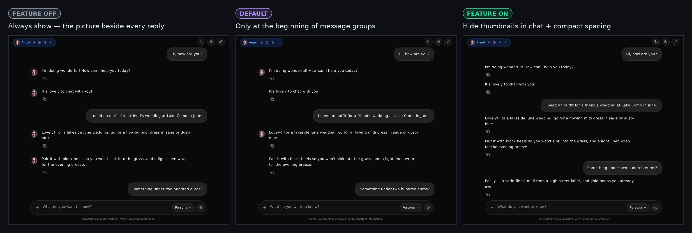
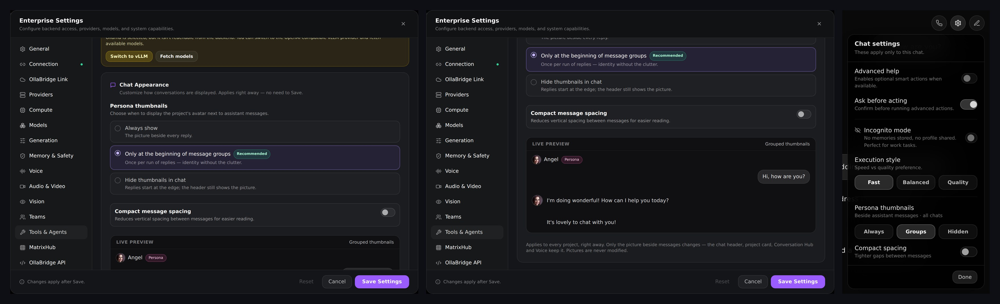

# Chat Appearance

**Settings → Chat** controls how conversations are laid out. The same choices
are in the chat's own settings popover (the gear at the top right of a chat).
Changes apply at once to every open chat and every project — no Save, no
reload.

## Persona thumbnails

When the project's picture appears beside assistant messages:

| Choice | Beside replies |
|---|---|
| Always show | The picture on every reply |
| **Only at the beginning of message groups** (default) | The picture on the first reply of a run; later replies in the same run keep the same indent, so their text lines up under the first |
| Hide thumbnails in chat | No picture and no reserved space — replies start at the edge |

A run ends at any user message, call row or routine marker. Phones never
showed the picture beside replies (there is no room), so the choice changes
desktop and tablet layouts.

Only the avatar beside chat messages follows this setting. The project's
picture in the chat header, on its project card, in the Conversation Hub and in
Voice is unchanged, and no picture is modified or deleted. Without a project,
the same choice applies to HomePilot's own mark beside replies.

Each message keeps an accessible name — the persona's name for replies, "You"
for yours — so it is identifiable with or without the picture.

## Compact message spacing

Halves the gap between messages (32 px → 16 px) for long conversations.

## Live preview

The preview draws a short exchange with the open persona's name and picture
(a placeholder when no project is open) using the same rule as the chat.

## Where it lives

The choice is stored on this device (`localStorage["homepilot_chat_appearance"]`,
`{ thumbnails: "always" | "grouped" | "hidden", compact: boolean }`), like
Motion, and announced with an `hp:chat-appearance-change` event; other tabs
follow through the `storage` event.

Code: `ui/chatAppearance.ts` (preference and the avatar rule),
`ui/components/ChatAppearanceSettings.tsx` (settings, preview, popover controls),
`ChatState` in `ui/App.tsx` (the chat). Tests: `src/test/chatAppearance.test.tsx`.
