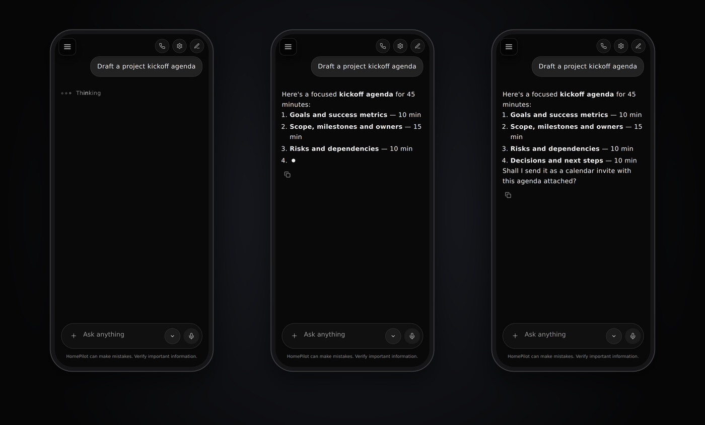
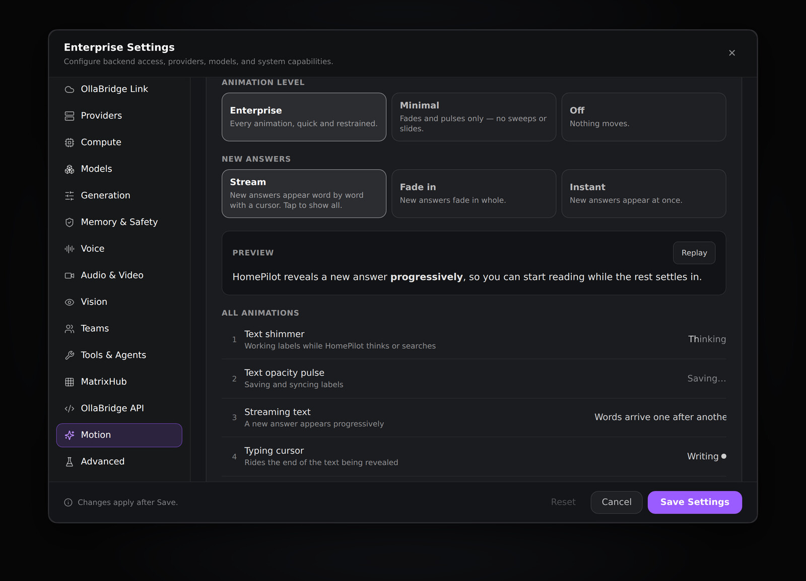

# Chat motion

HomePilot's chat uses one restrained set of animations, so the app feels
responsive and calm rather than busy. Voice mode keeps its original look. It is **additive**: nothing that
worked before was removed, every animation has a readable static equivalent,
and the whole system can be turned down or off per device.



## Choosing how much moves

**Settings → Motion** (applies immediately, remembered on this device):

| Setting | Options | Default |
|---|---|---|
| Animation level | **Enterprise** — every animation, quick and restrained · **Minimal** — fades and pulses only, no sweeps, slides, orbits or press scaling · **Off** — nothing moves | Enterprise |
| New answers | **Stream** — revealed word by word with a typing cursor; tap to show all · **Fade in** — the previous behaviour · **Instant** | Stream |

The operating system's *reduce motion* setting always wins: with it on, nothing
animates whatever is chosen here. The same page lists all 22 animations running
live, so the choice can be judged before it is made.



## The catalogue

| # | Animation | Where HomePilot uses it | Built with |
|---|---|---|---|
| 1 | Text shimmer | The *Thinking* / *Searching…* label of a pending answer; Voice's *Processing…* | `ShimmerText`, `.hp-shimmer-text` (gradient + `background-clip: text`, animated `background-position`) |
| 2 | Text opacity pulse | *Saving…* in Account Settings; replaces the shimmer at the Minimal level | `PulseText`, `.hp-pulse-text` |
| 3 | Streaming text | A newly arrived answer appears progressively (≤ 1.6 s, paced by length) | `StreamReveal` |
| 4 | Typing cursor | Rides the end of the last line while an answer is revealed | `[data-hp-caret]`, `TypingCursor` |
| 5 | Loading dots | Beside the pending answer's label | `LoadingDots` |
| 6 | Loading spinner | Save All while saving | `Spinner`, `.hp-spin` |
| 7 | Skeleton shimmer | Account Settings while loading; Model Management while models load | `Skeleton`, `.hp-skeleton` |
| 8 | Fade in | New answers (the *Fade in* setting), the *Copied* check mark, *Saved* | `animate-fadeIn`, `.hp-enter-fade`, `Presence` |
| 9 | Fade out | Ready for anything dismissed (`Presence` keeps it mounted until it has faded); dialogs use their own (20) | `.hp-exit-fade`, `Presence` |
| 10 | Slide in | Ready for side panels (`Presence variant="slide-left"`); the phone menu has its own (21) | `.hp-enter-slide-left`, `Presence` |
| 11 | Slide out | The same, leaving | `.hp-exit-slide-left`, `Presence` |
| 12 | Accordion expand | *Technical details* on the error screen (`<details class="hp-accordion">`); `Collapsible` for any section | `Collapsible`, `.hp-collapsible` (grid-rows 0fr → 1fr), `::details-content` |
| 13 | Accordion collapse | The same, closing | as above |
| 14 | Button hover transition | Every button without its own transition, on devices that can hover | `:where(button…)` transition in `motion.css` |
| 15 | Button press feedback | Buttons dip to 97 % while pressed (the `scale` property, so it never fights a button's own transform) | `motion.css` |
| 16 | Message reveal | Each new turn rises into place; your own messages from the right | `.hp-msg-in`, `.hp-msg-in--user` |
| 17 | Tool status transition | *Thinking…* → *Searching…* → *Retrying…*: the old label leaves upward as the new one arrives, announced once to screen readers | `StatusText` |
| 18 | Voice orb | Available as a component (breathes when idle, follows the voice level, orbits while thinking, rings while speaking). Not used by Voice mode, which keeps its original five-bar icon. | `VoiceOrb`, `.hp-orb` |
| 19 | Audio waveform | Available as a component: bars follow a live audio level. Not used by Voice mode. | `AudioWaveform`, `.hp-wave` |
| 20 | Modal transition | Every `ModalSheet` dialog rises in; on close an inert copy fades out after React removes it | `.hp-sheet`, `ModalSheet` |
| 21 | Sidebar transition | The phone menu slides in over a fading backdrop | `.hp-drawer`, `.hp-drawer-backdrop` |
| 22 | Progress indicator | Model Management's refresh actions; available for uploads | `ProgressBar`, `.hp-progress` (determinate or sweeping) |

## How the answer reveal works

HomePilot receives an answer whole, so the reveal is presentation only: the
full text is in state from the start, *Copy* copies all of it, and a tap shows
the rest at once. `StreamReveal` reveals whole words on an ease-out curve —
short replies settle in about half a second, long ones never take longer than
1.6 s — re-rendering at most ~30 times a second. An unfinished code fence is
closed while revealing, so partial code still renders as code. Only answers that
arrive while you are looking are revealed; history loads as it is.

## Using it in code

```tsx
import { ShimmerText, LoadingDots, StatusText, StreamReveal, VoiceOrb, ProgressBar } from './motion'

<StatusText text={step} />                      // "Searching" → "Reading 3 sources"
<ProgressBar label="Uploading" value={0.4} />   // or no value for a sweep
<StreamReveal text={answer} active={isNew} render={(t) => <MessageMarkdown text={t} />} />
```

Components render their final state where motion can't run (motion off, reduce
motion, unit tests), so a test sees what a person sees once an animation ends.
`motionAllowed()` and `useMotionPrefs()` (in `motion/prefs.ts`) are the single
source of truth.

## Accessibility

- Every animation has a static meaning: labels stay readable, progress has
  `role="progressbar"`, loading dots and spinners carry a label, the orb and
  waveform are decorative (`aria-hidden`) next to a text status.
- Status changes are announced once (`role="status"`), not on every frame.
- An answer being revealed is marked `aria-busy` until it is complete.
- Reduce motion and the *Off* level stop every animation, including the ones
  that existed before this system.

## Tests

`src/test/motionSystem.test.tsx` covers the preferences (defaults, validation,
persistence, live change), the reveal's word stops, pacing and code-fence
handling, the primitives' accessible output, the 22-item Settings list, and the
Back gesture closing layers in order.
