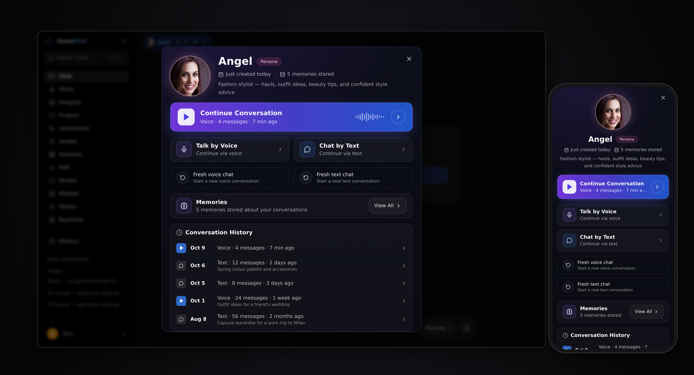

# Conversation Hub

Opening a persona project shows its Conversation Hub: the persona's identity
first, then the ways to talk to it. It is a visual and interaction upgrade
only — projects, sessions, memories and voice behave exactly as before, and no
API changed.

## Layout

| Section | What it shows | What it does |
|---|---|---|
| Identity | The project's saved picture (circular, with a glow tinted from the picture), name, type badge, how long since it was created, memories stored, description | — |
| Continue Conversation | The latest conversation's type, message count and last activity | Reopens it. If the open conversation is still empty (e.g. Voice just started one), it reopens the most recent conversation that has messages. It never creates a new one. |
| Talk by Voice · Chat by Text | Side by side on desktop, stacked on phones | Resume the current conversation in that mode |
| Fresh voice chat · Fresh text chat | Secondary actions | End the current conversation and start a new one |
| Memories | Count, and **View All** | Opens the existing memory manager in place (forget one, forget all — with confirmation) |
| Conversation History | Newest first: date, type, messages, last activity, summary | Opens that conversation; **View All** beyond five; short conversations (< 3 messages) hidden unless asked for |

A persona with no conversations yet is welcomed with its picture, *Ready to meet
you*, and the two ways to start.

The hub is a `ModalSheet`: full-screen on phones, a centred card above;
Escape, the backdrop, the close button or the phone's Back gesture close it.

## The project's picture across the app

| Situation | Shown |
|---|---|
| No project open | The default HomePilot look (Voice: the five-bar icon) |
| Project without a picture | The project's type icon |
| Project with a picture | Its saved picture — project card, hub, chat header, beside its replies, and Voice |
| Project closed | The default look returns |

The picture always comes from the project's saved configuration
(`persona_appearance.selected_filename` / `selected_thumb_filename`), never a
generated stand-in. In Voice a static picture gets a ring that follows the
microphone level; the face itself is never animated. HomePilot has no
animated-avatar projects today, so no project switches to an animated face.

Code: `ui/sessions/SessionPanel.tsx` (hub content), `ui/sessions/PersonaHubDrawer.tsx`
(frame), `ui/components/ProjectAvatar.tsx`, `ui/projectIdentity.ts`. Tests:
`src/test/conversationHub.test.tsx`.
