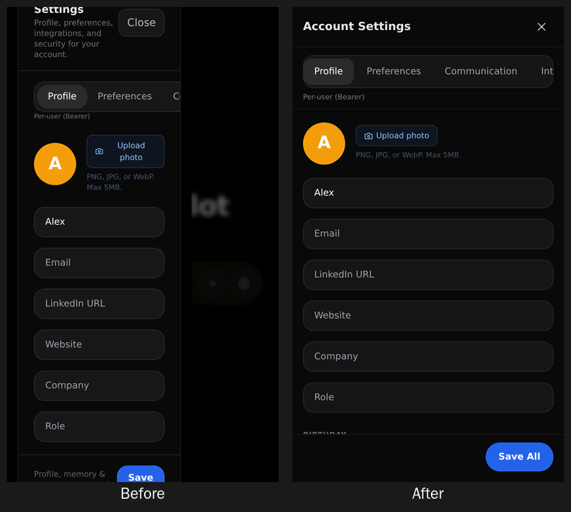
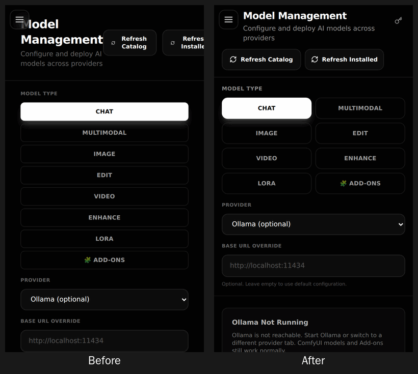
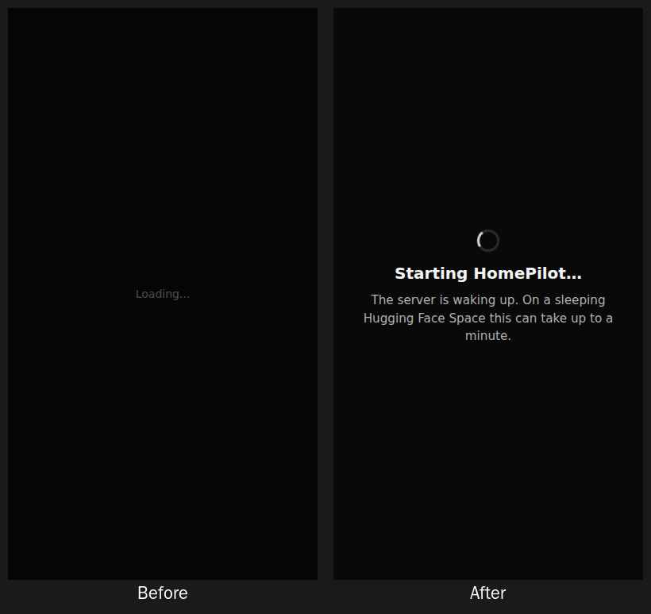
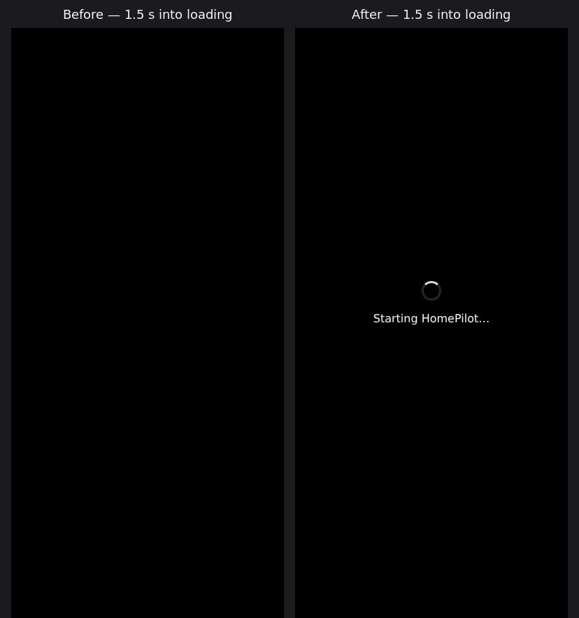
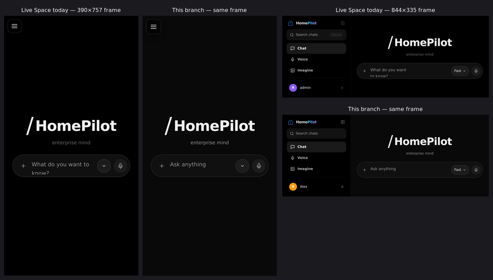
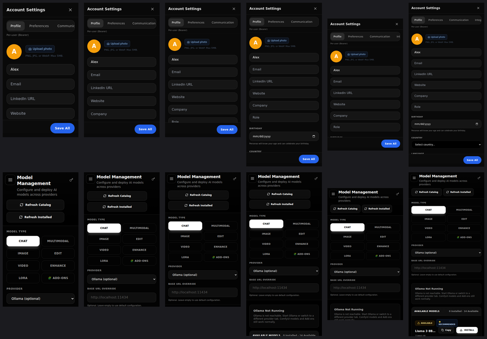

# Mobile web UI — diagnosis, design system and test results

HomePilot's web app is often opened on a phone, including inside its Hugging Face
Space. This page records what was wrong on mobile, why, how it was fixed at the
root, and how it was verified.

## Diagnosis

| Symptom | Root cause | Fix |
|---|---|---|
| A black screen while the app starts | The startup auth check (`/v1/auth/me`) had **no timeout**, and its loading state was “Loading...” at 30 % opacity on near-black — on a phone indistinguishable from a blank screen. A sleeping Space or a dropped request left it there indefinitely. There was also **no error boundary**: any render error unmounted the whole app, leaving only the black background. | A visible startup screen (“Starting HomePilot…”), a “the server is waking up” explanation after 5 s, a 25 s timeout that leads to “Can’t reach HomePilot” with **Retry** and **Continue anyway**, and an app-wide `AppErrorBoundary` with *Try again / Reload / Copy details* that logs one structured `[HomePilot] UI crashed` line. |
| Account Settings squeezed into a narrow column on the left, blurred space to its right | The dialog was rendered inside the sidebar. On phones the sidebar is a drawer that slides with a CSS **transform**, and a transformed ancestor becomes the containing block for `position: fixed` descendants — so the “full-screen” dialog was laid out inside the 280 px drawer. The main Settings panel, About and System Status dialogs had the same problem. | Dialogs opened from the sidebar are portalled to `<body>`; `ModalSheet` portals itself, so where a dialog is opened from can no longer affect its layout. |
| Title cut off at the top, **Save All** cut off at the bottom and wrapping | The dialog height was header + tabs + a `70vh` body + footer, which exceeds a short phone screen; centring then pushed both ends off-screen. | `ModalSheet`: full-screen below 640 px, a centred card above; header and footer fixed, **one** scrolling body, footer above the home indicator (`safe-area-inset-bottom`), Save All `whitespace-nowrap` with a 44 px target. |
| Settings tabs clipped | The tab row was an `inline-flex` that could not shrink or scroll. | `.hp-tabs`: scrolls sideways with snap; the active tab is scrolled into view. |
| Model Management heading hidden behind the menu button; refresh buttons squeezed beside it | The mobile menu button floats above every view, but page headers did not reserve room for it. The audit found the same overlap on **Avatar Studio** and **Routines**. | `.hp-page-header` / `.hp-clear-nav`: the title row starts after the menu button and aligns with it; description below; actions on their own row, sharing it when they fit and stacking on very narrow phones; a small icon action moves to the header corner. |
| Eight full-width Model Type rows before the provider controls | A desktop vertical list rendered unchanged on phones. | `.hp-choice-grid`: two columns on phones (200 px tall instead of ~360 px), four on tablets; the desktop list is unchanged. Exposed as a `radiogroup`. |
| Model Management cramped on short screens | Header and controls were fixed with only the list scrolling under them. | On phones the whole page is one scroller; tablet/desktop unchanged. |
| Composer placeholder cut off mid-word (“What do you want to kno”); long messages scrolled inside a one-line box | A long placeholder in a one-row textarea; no auto-grow. | Short placeholders on narrow phones (“Ask anything”), and the composer grows with its content up to the existing 400 px cap. |
| Pinch-zoom disabled; keyboard could cover the composer and Save All | `maximum-scale=1.0` in the viewport meta; the layout did not resize for the on-screen keyboard. | `maximum-scale` removed (inputs are already 16 px on touch, so iOS does not auto-zoom), and `interactive-widget=resizes-content` so the layout shrinks above the keyboard. |
| One desktop frame rendered before the mobile layout | `isMobile` started `false` and was corrected after the first render. | It is initialised from the real width. |
| A blank page for ~20 s on a slow connection | `#root` stayed empty until the 2.9 MB app script had downloaded; the startup screen above only exists once that script runs. | `index.html` paints a *Starting HomePilot…* screen with the first byte of HTML (measured on a 400 kbps / 400 ms link: first visible text at **0.6 s instead of 20.7 s**); after 40 s it says so and offers Reload. |
| The phone menu kept focus behind it, stayed open after picking a chat, and Back left the app | The drawer was a translated panel, not a dialog: no focus handling, the page behind stayed interactive, and only mode changes closed it. Chat header icons (z-50) also drew over it. | The drawer is a modal: focus moves in and back to the menu button, Tab stays inside, the page behind is `inert`, a 44 px close button, a fading backdrop, z-order above every view, and picking a conversation / History / New conversation closes it. The phone's **Back** gesture closes the drawer and every dialog (one history entry per open layer, closed top-first) instead of leaving HomePilot. |
| Text scrolled under the chat header icons; a darker box behind the composer | No background under the floating header row; the composer dock was `bg-black/95` on a `#090909` page. | A soft top scrim on phones; the dock blends into the page background. |
| Buttons stayed highlighted after a tap | Tailwind `hover:` styles also apply on touch screens and stick after the finger lifts. | `hoverOnlyWhenSupported`: hover styles only where a real hover exists. |
| Small icon buttons (copy, call, settings, mic) were 28–40 px; some had no accessible name (copy, voice controls, menu items named "Chat Ctrl+J") | Visual size used as hit area; shortcut hints inside the label. | `.hp-icon-btn` grows the hit area to 44×44 on touch without changing the look; labels added; shortcut hints are `aria-hidden` and exposed as `aria-keyshortcuts`; Provider / Base URL fields have labels. |
| Muted text at 25–40 % white (2–3.6:1) | Low-alpha text utilities used for secondary copy. | AA floors (≥ 4.5:1) for those utilities and placeholders; hierarchy kept. |
| No visible focus for keyboard users on many controls | `outline-none` utilities without a replacement. | A global `:focus-visible` ring (keyboard only). |
| Account Settings cramped on a phone on its side, or with the keyboard open | Header, tabs and footer left ~20 px for the form at 215 px of height. | On short screens the sheet scrolls as one page with Save pinned and `scroll-padding` so the edited field stays clear of it. |
| The composer hint was cut off in Hugging Face's landscape frame (844×335) | The short hint was chosen by window width; with the sidebar showing, the field is narrow in a wide window. | The hint follows the field's own width (`ResizeObserver`); the Model Type grid likewise follows its column (container query). |
| Model list said "No models found" while it was still loading | The empty state didn't check the loading flag. | Placeholder rows while loading; a progress sweep under the header during either refresh. |
| Routines said "Authentication required" while signed in (multi-user installs) | Its requests sent only the API key, not the session token. | The session token is sent, as every other API module does. |
| In the Docker image, chat did not work and the health check always failed | nginx forwarded only a fixed list of prefixes; the frontend calls most of the API at the site root (`/chat`, `/conversations`, …), so those got `index.html` or 405. `/health` and `/api/health` were proxied to a path the backend does not serve. | Built files from disk, page loads (`Accept: text/html`) get the app, everything else goes to the backend; both health paths map to `/health`. Verified with nginx 1.24 against the real backend. |

## Design system

Tokens (in `frontend/src/ui/styles.css`): background `#090909`, surface `#171717`,
input `#202020`, text `#F5F5F5`, secondary text `#B0B0B0` (9.1:1 on the background),
border `#303030`, 4 px spacing unit, 16 px horizontal padding, 44 px controls,
14 px card and 20 px sheet radii. These are HomePilot's own values.

Primitives:

- `ModalSheet` (`components/ModalSheet.tsx`) — portalled dialog; full-screen on phones; one scroller; sticky footer; Escape, backdrop press, focus moved in and restored, Tab kept inside, background scroll locked.
- `.hp-page-header` (+ `__titles`, `__actions`), `.hp-clear-nav`, `.hp-header-corner`, `.hp-grow-action` — page headers that never collide with the mobile menu button.
- `.hp-tabs`, `.hp-choice-grid` — sideways-scrolling tabs; compact category grid.
- `.hp-status-screen` / `.hp-status-card` / `.hp-spinner` — startup and error screens.
- `AppErrorBoundary` (`components/AppErrorBoundary.tsx`) — wraps the whole app in `main.tsx`.
- `prefers-reduced-motion` turns animations and transitions off.
- Motion system (`ui/motion/`, see [chat-motion.md](chat-motion.md)) — 22 restrained animations for chat, voice, dialogs and navigation, with *Settings → Motion* (Enterprise / Minimal / Off).
- `useBackToClose` (`lib/useBackToClose.ts`) — the phone's Back gesture closes the top open layer.
- `.hp-icon-btn` (44 px touch hit area), `.hp-cq` (container-query host), `.hp-drawer` / `.hp-drawer-backdrop`.

Account Settings also warns before discarding unsaved edits, shows “Unsaved changes / Saving… / Saved” in the footer, a skeleton while loading, and an inline error with **Retry**.

## Test results

Measured in Chromium with touch emulation, signed in, against a production build
served same-origin through the container's nginx configuration (as in the Docker
image and on Hugging Face).

### The 15 journeys, per device

Each run: open → menu, change sections (and Back closes the menu) → Account
Settings → every tab → edit the profile → keyboard open, lower field → Save and
check the server → close, reopen, value kept (Back closes the sheet) → Model
Management → every category → change provider → both refreshes → away and back →
reload → no blank screen, nothing under the menu button, no horizontal scroll, no
unlabeled button, no script error.

| Profile | Result | Notes |
|---|---|---|
| Phone 320×568 | 15/15 | Settings full-screen; Model Type 200 px |
| Phone 390×844 | 15/15 | |
| Phone landscape 844×390 | 15/15 | Short-screen sheet: field and Save visible with the keyboard open |
| 390 px phone at 150 % zoom (260×563) | 15/15 | |
| Slow 3G (500 kbps, 400 ms) on 390×844 | 15/15 | *Starting HomePilot…* at 0.5 s, usable at 17.5 s |
| Reduce motion on 390×844 | 15/15 | |
| Tablet 768×1024 | 15/15 | Settings as a centred card |
| Desktop 1280×800 | 15/15 | |
| Hugging Face frame, portrait (390×757, measured on the live Space) | 15/15 | |
| Hugging Face frame, landscape (844×335, measured on the live Space) | 15/15 | |

### Layout matrix

| Viewport | Horizontal overflow | Account Settings | Save All fully visible | Keyboard open (layout shrunk to 55 %): edited field and Save All visible | Main Settings panel | Model Management title clear of menu | Model Type height | Script errors |
|---|---|---|---|---|---|---|---|---|
| 320×568 | none | full-screen | yes | yes | full-screen | yes | 200 px | 0 |
| 360×640 | none | full-screen | yes | yes | full-screen | yes | 200 px | 0 |
| 375×667 | none | full-screen | yes | yes | full-screen | yes | 200 px | 0 |
| 390×844 | none | full-screen | yes | yes | full-screen | yes | 200 px | 0 |
| 412×720 | none | full-screen | yes | yes | full-screen | yes | 200 px | 0 |
| 430×932 | none | full-screen | yes | yes | full-screen | yes | 200 px | 0 |
| 768×1024 | none | centred card | yes | yes | centred | yes | 200 px (2 columns: its column is 456 px wide beside the sidebar) | 0 |
| 1280×800 | none | centred card | yes | yes | centred | yes | 394 px (desktop list) | 0 |

Every navigation section (Imagine, Project, Interactive, Avatar, Animate, Edit,
Studio, Models, Teams, Routines, Chat) was also checked at 320 and 390 px:
no text under the menu button and no horizontal overflow.

Automated: `src/test/mobileShell.test.tsx` (portal escapes a transformed parent;
dialog semantics; Escape/backdrop/Tab; single-line Save All in the sticky footer;
unsaved-changes confirmation; startup slow-start hint, timeout, Retry and
Continue anyway; error boundary recovery) and `src/test/motionSystem.test.tsx`
(motion preferences, answer reveal, primitives, Settings → Motion, Back closes the
top layer). Full suite: 1326 tests pass; `tsc` and `vite build` pass.

## Remaining limitations

- Verified in Chromium with touch emulation, not on physical Android/iOS devices or iOS Safari's WebKit. The keyboard was simulated by shrinking the viewport, which is what `interactive-widget=resizes-content` makes Android Chrome do.
- The live Space still runs the previous release, so this branch was tested in frames of the exact size the Space gives the app (measured there: 390×757 portrait, 844×335 landscape), not inside the Space itself. The outer page and its viewport meta belong to Hugging Face and decide how the keyboard is handled there.
- The redesign covers the shell, startup, navigation, chat and voice, Account Settings, the Settings panel, Model Management, and the headers that collided with the menu button; contrast floors, focus rings and touch targets apply everywhere. Other screens keep their own styling: the audit shows no overlap or overflow, but they have not been restyled to the new tokens.
- The *Fade out* and *Slide in/out* motion primitives are ready but not yet used by a screen of their own (dialogs and the menu have their own transitions).
- “Continue anyway” keeps the previous behaviour of entering the app without the server, which then shows each feature's own offline state.
