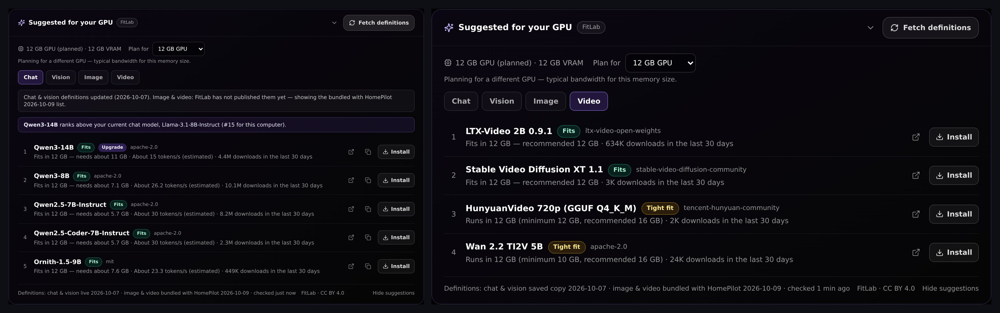
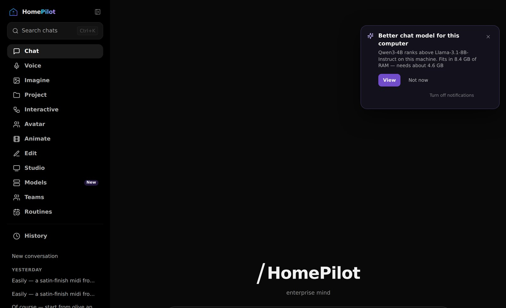
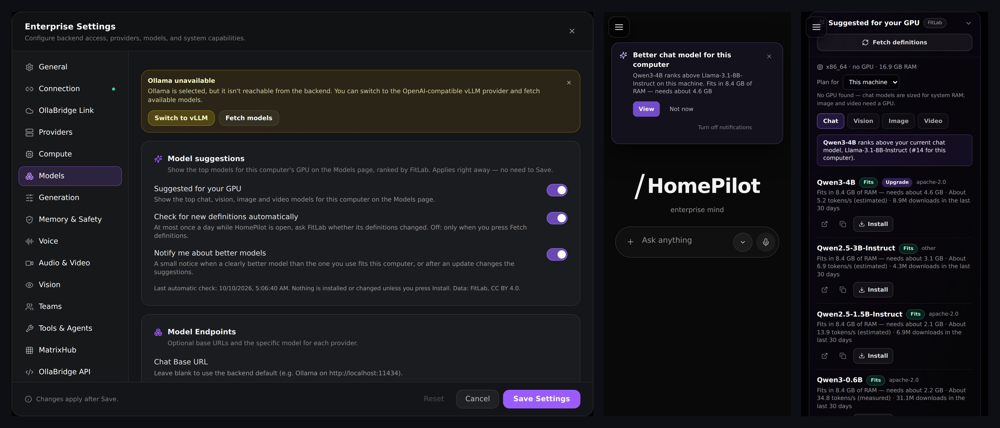

# Model Advisor — suggested models for your GPU

**Models → Suggested for your GPU** shows the top 5 **chat, vision, image and video** models for
the computer HomePilot runs on, ranked by [FitLab](https://github.com/ruslanmv/fitlab). It says
how much memory each needs, how fast it should run, whether it is installed, and installs it on
request. It is optional and additive: it never changes a setting or downloads anything on its own.



## What it does

| | |
|---|---|
| **Detects the machine** | NVIDIA GPU (VRAM + memory bandwidth, matched against FitLab's 85-GPU catalogue), Apple Silicon (unified memory), or CPU only (chat sized for system RAM; image/video need a GPU). **Plan for** previews any other GPU size. |
| **Ranks with FitLab's own math** | Chat & vision: FitLab's FITS arithmetic (Q4_K_M, 8K context) and ranking v1.1, evaluated for *this* GPU instead of FitLab's reference cards; measured benchmarks are used when FitLab has one for this GPU, and estimated speeds are corrected by FitLab's published calibration. Image & video: FitLab's media lane weights and components; only the fit verdict is computed here. Models below reading speed (< 5 tokens/s) rank lower and say "slow on this machine". |
| **Only what HomePilot can install** | Chat/vision need an Ollama tag; image/video need a HomePilot catalogue id. **Install** (after an inline confirmation showing the download size) uses the existing `POST /models/install`. |
| **Marks your models** | "In use" on the model selected in Settings, "Installed" on what is on disk, and "Upgrade" when FitLab ranks another model clearly higher (≥ 0.03 score points) for this computer. |
| **Explains every number** | Fit, memory needed, tokens/s (measured or estimated), 30-day downloads, licence, a Hugging Face link, and the source and date of the definitions. |

## Definitions, updates and notifications

FitLab publishes its definitions weekly. HomePilot reads them in this order:

1. **Fetch definitions** — the button on the card. One conditional request per feed: FitLab's
   `registry-latest` branch first, then `master` (or `FITLAB_REGISTRY_URL` / `FITLAB_MEDIA_URL`).
   The stored ETag is sent, so an unchanged feed answers `304` and nothing is downloaded.
2. **The last copy fetched on this machine**, if any.
3. **The snapshot bundled with this HomePilot release** — the "current version" used when there is
   no internet. Every release carries the FitLab data current when it was built.

The card always says which one it is showing ("live", "saved copy", "bundled with HomePilot") and
when it was last checked. If FitLab cannot be reached, the current list stays and the card says so.



**Automatic check** (on by default, Settings → Models → Model suggestions): at most once a day
while HomePilot is open, the same conditional request runs in the background; after a failure it
retries in 6 hours. Off: FitLab is contacted only when you press **Fetch definitions**.

**Notifications** (off by default — turn on *Notify me about better models* in Settings → Models →
Model suggestions): one quiet, non-modal notice at a time —

- *Better chat / vision / image / video model for this computer* — when FitLab ranks a model
  clearly above the one you have selected;
- *Model suggestions updated* — after new definitions or a HomePilot update change the list
  (*New: model suggestions for your GPU* the first time).

Each notice offers **View** (opens the card on the right tab), **Not now** (snoozes that notice for
7 days) and **Turn off notifications**. The **Models** entry in the sidebar shows **New** until you
open the suggestions. Turning notifications off silences both; suggestions stay available.



## Switches

| Where | Switch | Effect |
|---|---|---|
| Settings → Models (this device) | Suggested for your GPU | Hide the card, the notices and every request |
| | Check for new definitions automatically | Daily background check on/off |
| | Notify me about better models | Notices and the New badge on/off (off by default) |
| Server environment | `FITLAB_ENABLED=false` | Feature off for everyone (the UI hides it) |
| | `FITLAB_OFFLINE=true` | Never contact FitLab; cached / bundled data only |
| | `FITLAB_REGISTRY_URL`, `FITLAB_MEDIA_URL` | An internal mirror (`https://` or `file://`) |
| | `FITLAB_CACHE_DIR` | Where fetched definitions are kept (default: next to the database) |

## Safety

- Read-only: no setting changes, no downloads without **Install** and its confirmation.
- Network only to the configured FitLab URLs; `https://` or `file://` only; 12 MB / 8 s limits; a
  document is used only if it parses and has the expected shape — otherwise the previous copy stands.
- Nothing about the machine is sent: the request is a plain GET for a public file.

## API

| Endpoint | Purpose |
|---|---|
| `GET /v1/model-advisor` | Suggestions from cached/bundled data. No network. |
| `POST /v1/model-advisor/fetch` | Fetch definitions (conditional), then suggestions. |

Query: `kind` (chat, vision, image, video), `limit` (1–10, default 5), `vram_gb` (plan for),
`current_chat`, `current_vision`, `current_image`, `current_video` (enables upgrade detection).
The response carries `hardware`, `feeds` (source, `generated_at`, `checked_at`), `suggestions`,
`upgrades`, `fetch` (`ok`, `partial`, `changed`, `errors`) and FitLab's attribution.

## Maintainers

Refresh the bundled snapshot before a release (optional — it is only the offline fallback):

```bash
python backend/scripts/update_fitlab_snapshot.py               # from FitLab on GitHub
python backend/scripts/update_fitlab_snapshot.py --check       # report its age
```

FitLab's media lane (image + video, `data/media_registry.json`) is defined in the FitLab
repository; until it is published on FitLab's `registry-latest`, image and video suggestions come
from the bundled snapshot and the card says so.

Code: `backend/app/model_advisor/` (feed, hardware, ranking, routes), `frontend/src/ui/modelAdvisor.ts`,
`components/ModelAdvisorCard.tsx`, `components/AdvisorUpdateNotice.tsx`. Tests:
`backend/tests/test_model_advisor.py`, `frontend/src/test/modelAdvisor.test.tsx`.

Model data © FitLab contributors, [CC BY 4.0](https://creativecommons.org/licenses/by/4.0/).
